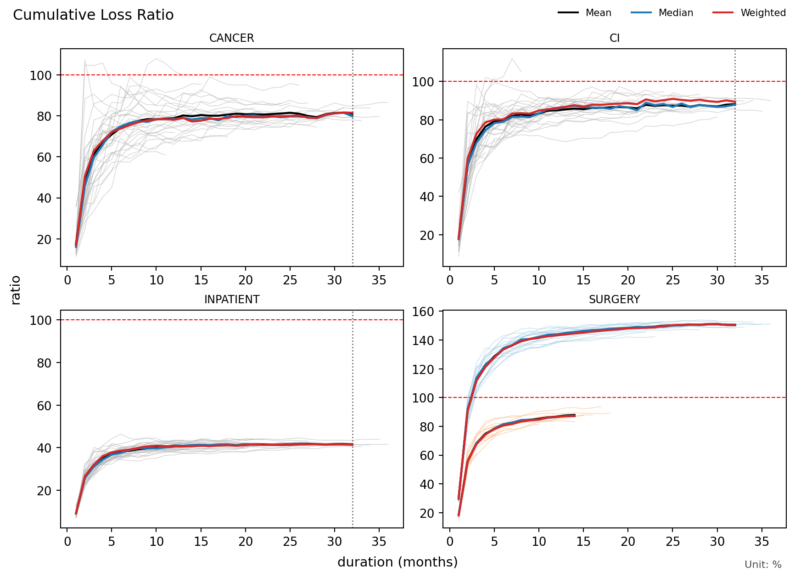

# lossratio

Loss ratio analytics for long-term health insurance — cohort experience
analysis, a family of loss-side projection models, a denominator (premium)
model, loss-ratio composition with an uncertainty band, regime detection, and
out-of-sample backtest validation on long-format experience data.

The package treats each underwriting cohort's loss and premium as ongoing flows
that keep developing with duration (elapsed time since inception): it *projects*
loss, premium, and the loss ratio forward along the duration axis and quantifies
how reliable those projections are out of sample.

This Python implementation is in active development; install from GitHub (see
below). The PyPI build is an earlier, now-discarded methodology.

## Install

> [!WARNING]
> **Work in progress** — the theoretical foundation is being substantially
> revised, so the API and numerical results may still change. The build on PyPI
> uses an earlier, now-discarded methodology; install from GitHub for the latest.

```bash
pip install "git+https://github.com/seokhoonj/lossratio.git"              # polars only
pip install "lossratio[pandas] @ git+https://github.com/seokhoonj/lossratio.git"      # add pandas / pyarrow support
```

## Components

**Data**

- `Triangle` — cohort x duration aggregation. Accepts a long-format experience
  frame (`uy_m`, `cy_m`, `duration_m`, `incr_loss`, `incr_premium`), validates
  the schema, and adds derived period columns inline (`duration_m` is derived
  from `uy_m` and `cy_m` if absent). Cumulative is the unmarked default
  (`loss`, `premium`, `ratio`); per-period values carry an `incr_` prefix.

**Loss models** — sklearn-style estimators, each returning a `LossFit`:

- `PooledLoss` — complete pooling: one shared duration shape (incremental loss
  intensity per unit premium), premium-anchored additive projection. The safe
  default baseline.
- `CredibleLoss` — `PooledLoss` plus a per-cohort credibility level
  (Buhlmann-Straub shrinkage toward the pooled shape); exposes per-cohort
  `u` / `Z` / `psi` via `.credibility`.
- `SmoothLoss` — `CredibleLoss` with a smooth (penalized P-spline) duration
  shape in place of the saturated one.
- `ChainLadder` — the chain-ladder benchmark: own-loss multiplicative link
  ratios (age-to-age factors), no premium anchor.

**Premium & composition**

- `PooledPremium` — returns a `PremiumFit`. Premium has no external exposure,
  so it self-develops by its own volume-weighted link ratio.
- `Ratio(loss=..., premium=...)` — pairs a loss and a premium estimator into
  `ratio_proj = loss_proj / premium_proj` (a `RatioFit`). The premium is a
  known allocated exposure, so the band is loss-only:
  `ratio_se = loss_total_se / premium_proj`.

**Uncertainty, diagnostics & validation**

- `ResidualBootstrap` — pass as `uncertainty=` to a loss estimator for a
  full-refit residual bootstrap (calendar-drift band) that fills
  `loss_total_se` / `loss_ci_lo` / `loss_ci_hi` and the ratio band.
  `PooledLoss` / `ChainLadder` carry an analytical SE by default;
  `CredibleLoss` / `SmoothLoss` are point-only unless a bootstrap is attached.
- `Triangle.link()` — the long-format `Link` table (one row per cohort x
  adjacent duration pair); `.ata()` / `.intensity()` give factor-level
  diagnostics (multiplicative `ata` / `cv` / `rse`, additive `intensity`).
- `RegimeDetector` — change-point detector config; `RegimeDetector(...).detect(tri)`
  returns a `Regime` (structural cohort-sequence shifts via E-Divisive or Ward
  hierarchical clustering). Pass it as `regime=` to re-detect on each backtest
  fold's own data.
- `Backtest` — calendar-diagonal hold-out backtest of any estimator; a sequence
  `holdouts=(6, 12, ...)` runs a rolling-origin backtest with
  `reliable_horizon()`. `EstimatorComparison` scores estimators head-to-head.

## Quick Start

```python
import lossratio as lr

# Bundled synthetic experience: four coverages (CANCER / CI / INPATIENT /
# SURGERY), monthly cohorts to 36 duration months; SURGERY carries a regime
# shift at 2024-07.
df = lr.load_experience()

# Build the cohort x duration triangle, grouped by coverage. Every estimator and
# detector below fits per group, with `coverage` labelling each output row.
tri = lr.Triangle(df, groups="coverage")
tri
#> <Triangle: 2,664 rows, 4 groups, 36 cohorts x 36 durations (M)>

# Compose a loss ratio from a loss model over a premium model, then read the
# projected ratio per cohort (ratio_se is null for the fully observed first
# cohort; the premium is a known denominator, so the band is loss-only). Swap in
# CredibleLoss / SmoothLoss / ChainLadder on the loss side; see Components.
fit = lr.Ratio(loss=lr.PooledLoss(), premium=lr.PooledPremium()).fit(tri)
fit.summary().select(["coverage", "cohort", "ratio_proj", "ratio_se"]).head(3)
#> shape: (3, 4)
#> ┌──────────┬────────────┬────────────┬──────────┐
#> │ coverage ┆ cohort     ┆ ratio_proj ┆ ratio_se │
#> │ str      ┆ date       ┆ f64        ┆ f64      │
#> ╞══════════╪════════════╪════════════╪══════════╡
#> │ CANCER   ┆ 2023-01-01 ┆ 0.866128   ┆ null     │
#> │ CANCER   ┆ 2023-02-01 ┆ 0.801566   ┆ 0.006256 │
#> │ CANCER   ┆ 2023-03-01 ┆ 0.84415    ┆ 0.006895 │
#> └──────────┴────────────┴────────────┴──────────┘

# Detect cohort regime shifts (E-Divisive over the cohort ratio path).
reg = lr.RegimeDetector(target="ratio", window=12).detect(tri)
reg.change_points
#> [datetime.date(2024, 7, 1)]

# View the experience with a per-regime Mean / Median / Weighted summary overlay
# -- SURGERY splits into two bands (pre-2024-07 near 150%, post near 90%).
tri.plot(metric="ratio", summary=True, regime=reg)
```



```python
# Project the loss ratio respecting that regime (segment_wise: each regime's
# cohorts develop along their own shape). Observed solid, the projection a
# faded continuation past the frontier dot, coloured by cohort (the colourbar
# reads 23.01, 23.10, ... period labels).
reg_fit = lr.Ratio(
    loss=lr.PooledLoss(regime=lr.RegimeDetector(treatment="segment_wise")),
    premium=lr.PooledPremium(),
).fit(tri)
reg_fit.plot()
```


```python
# Out-of-sample: a rolling-origin backtest reports how many duration months
# ahead each coverage's projection stays within tolerance.
lr.Backtest(estimator=lr.PooledLoss(), holdouts=(6, 12), target="loss").fit(tri).reliable_horizon()
#> shape: (4, 3)
#> ┌───────────┬──────────────────┬─────────────┐
#> │ coverage  ┆ reliable_horizon ┆ max_horizon │
#> │ str       ┆ i64              ┆ i64         │
#> ╞═══════════╪══════════════════╪═════════════╡
#> │ CANCER    ┆ 6                ┆ 12          │
#> │ CI        ┆ 12               ┆ 12          │
#> │ INPATIENT ┆ 12               ┆ 12          │
#> │ SURGERY   ┆ 3                ┆ 12          │
#> └───────────┴──────────────────┴─────────────┘
```

To plug in your own data, build a long-format frame with these columns and pass
it to `lr.Triangle(df, groups=...)`:

- `uy_m` (date) — underwriting year-month (cohort)
- `cy_m` (date) — calendar year-month
- `duration_m` (int, optional) — duration (months); auto-derived from `uy_m`
  and `cy_m` if absent
- `incr_loss` (numeric) — per-period claim amount
- `incr_premium` (numeric) — per-period premium

The shipped `lr.load_experience()` dataset includes the full 12-column M/Q/H/Y
grain enrichment. Coarser granularities (`duration_q`, `duration_h`,
`duration_y` — quarterly, half-yearly, yearly) can also be derived from a bare
monthly frame via `derive_grain_columns(df)`, which produces
`uy/uy_h/uy_q/uy_m`, `cy/cy_h/cy_q/cy_m`,
`duration_y/duration_h/duration_q/duration_m`. Pass `grain="Q"` / `"H"` / `"Y"`
to `Triangle()` to aggregate at a coarser grain (default `"auto"` detects from
data spacing).

Pandas inputs are accepted too; outputs mirror the input type (pandas in ->
pandas out, polars in -> polars out). Use the ``[pandas]`` install extra (see
above) to pull in `pandas` and `pyarrow`.

## Author

Seokhoon Joo
([@seokhoonj](https://github.com/seokhoonj),
<seokhoonj@gmail.com>)

## License

MPL-2.0 (Mozilla Public License 2.0).
