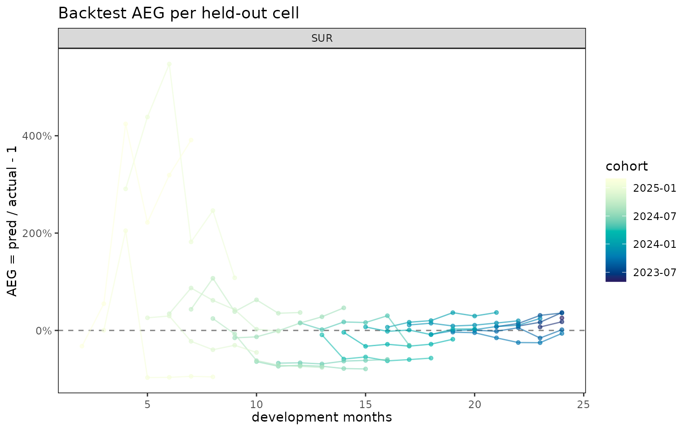
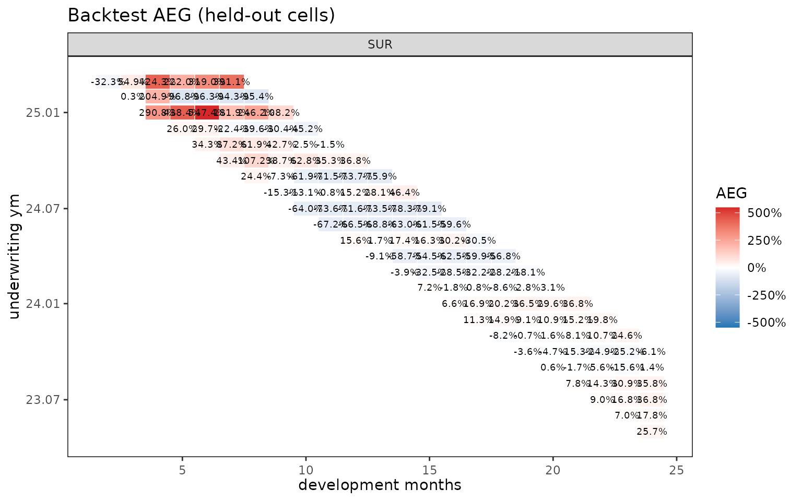

# 홀드아웃 대각선을 이용한 추정 백테스팅

> 영어 원본 보기: [Backtesting projections against held-out
> diagonals](https://seokhoonj.github.io/lossratio/backtest.md)

## 동기

준비금 산출과 추정(projection) 방법은 관측된 자료에 적합되지만, 실무적
가치는 과거 valuation 시점(평가 시점)에서 그 방법이 어떻게 작동했을지에
달려 있다.
[`backtest()`](https://seokhoonj.github.io/lossratio/reference/backtest.md)
는 triangle 에서 가장 최근 `holdout` 개의 대각선(calendar diagonal)을
가린 뒤, 이전 부분에 모형을 재적합하고, 그 추정값을 가려두었던 실제값과
비교함으로써 이 질문에 답한다. 이는 경과 기간 단위 홀드아웃이 아니라
대각선 단위 홀드아웃인데, “*K* 개월 전 valuation 시점에서 모형은
무엇이라 말했을까?” 를 모사하기 때문이다. 셀 단위 지표는 AEG
(Actual-Expected Gap, 실제-예측 차이) 이며,
$`\mathrm{aeg} = v_{\mathrm{pred}} / v_{\mathrm{actual}} - 1`$ 로
정의한다. 양수는 과대 추정, 음수는 과소 추정을 의미한다.

## 기본 사용법

``` r

library(lossratio)
data(experience)
exp     <- as_experience(experience)
tri_sur <- build_triangle(exp[cv_nm == "SUR"], cv_nm)

bt <- backtest(tri_sur, holdout = 6L, value_var = "closs", method = "mack")
print(bt)
#> <backtest>
#>   fit_fn      : fit_cl
#>   value_var   : closs
#>   holdout     : 6 calendar diagonals
#>   held-out    : 123 cells
#>   AEG         : mean 19.81% / median 2.47%
```

반환되는 객체는 `"backtest"` 리스트이며, 주요 슬롯은 다음과 같다.

- `aeg` — 셀 단위 `data.table` (cohort, dev, actual, pred, aeg,
  calendar_idx).
- `col_summary` — `dev` 별로 집계된 AEG.
- `diag_summary` — 대각선별로 집계된 AEG.
- `masked` — 적합에 사용된 triangle (최근 대각선이 제거됨).
- `fit` — `fit_fn` 이 반환한 적합 객체 (`cl_fit` 또는 `lr_fit`).

`summary(bt)` 는 호출 메타데이터와 함께 두 요약 표를 출력한다.

## 대각선 마스킹의 한계

가장 최근 `holdout` 개의 대각선을 제거하면 triangle 의 우하단 가장자리가
짧아진다. 마스킹된 triangle 에 적합된 chain ladder 는 자신의 가장 긴
cohort × dev 지지(support) 까지만 추정할 수 있으며, 그 범위를 넘어서는
셀들 — 가장 오래된 코호트의 가장 큰 경과 기간에 해당하는 셀들 — 은
비교할 추정값이 아예 존재하지 않는다. 함수는 이러한 도달 불가능 셀들을
조용히 걸러내므로, `bt$aeg` 에는 항상 실제값과 유한한 추정값이 모두
존재하는 셀만 포함된다. 실무적 함의: `holdout` 이 몇 개의 대각선보다
커지면 가장 오래된 코호트에서 검증 셀이 가장 빨리 줄어들며, 이는 chain
ladder 가 본래 자신의 외삽된 꼬리에 의존하는 영역이다.

## 출력 해석

**`col_summary` — 경과 기간별 체계적 편향.** 특정 dev 에서 AEG 의 부호가
일관되게 나타나면, 그 성숙도에서 모형과 자료 사이에 구조적 불일치가
있음을 시사한다. 초기 dev 의 양의 값은 보통 부풀려진 link factor 를
반영하고, 후기 dev 의 값은 꼬리 미보정(miscalibration) 을 시사한다.

``` r

head(bt$col_summary, 8)
#>     cv_nm   dev     n   aeg_mean    aeg_med     aeg_wt
#>    <char> <int> <int>      <num>      <num>      <num>
#> 1:    SUR     2     1 -0.3228967 -0.3228967 -0.3228967
#> 2:    SUR     3     2  0.2760710  0.2760710  0.5380116
#> 3:    SUR     4     3  3.0666760  2.9082082  3.3631170
#> 4:    SUR     5     4  1.4738566  1.2395963  1.2478607
#> 5:    SUR     6     5  1.6680813  0.3429063  1.3252178
#> 6:    SUR     7     6  0.9780860  0.6530255  0.8186990
#> 7:    SUR     8     6  0.5077618  0.4315486  0.6924133
#> 8:    SUR     9     6  0.2276918  0.1570609  0.2440447
```

`aeg_mean` 은 셀 단위 AEG 의 평균, `aeg_med` 는 중앙값,
`aeg_wt = sum(pred - actual) / sum(actual)` 은 노출 가중 평균이다. 세
컬럼을 비교하면 소수의 큰 셀이 결과를 지배하는지 (`aeg_wt` 가 `aeg_med`
와 크게 다른 경우) 또는 편향이 균일한지 식별할 수 있다.

**`diag_summary` — 대각선 효과(calendar-year effect).** 그 외에는 편향이
없는 출력에서 단 하나의 대각선만 나쁘게 나타난다면, 정적 chain ladder 가
구조상 볼 수 없는 calendar 사건 (요율 변경, 보험금 처리 방식의 변화,
일회성 충격) 을 가리킨다.

``` r

bt$diag_summary
#>     cv_nm calendar_idx     n   aeg_mean      aeg_med      aeg_wt
#>    <char>        <int> <int>      <num>        <num>       <num>
#> 1:    SUR           25    23 0.13326079  0.070162079  0.03862954
#> 2:    SUR           26    22 0.33811631  0.079737970  0.01255411
#> 3:    SUR           27    21 0.36867941  0.015893924  0.03207125
#> 4:    SUR           28    20 0.07217789 -0.002690612 -0.04810613
#> 5:    SUR           29    19 0.14188721  0.024717168 -0.06295772
#> 6:    SUR           30    18 0.11032715 -0.037993393 -0.01415728
```

대각선을 가로지르는 단조로운 표류 (위 SUR 예시처럼 `25, ..., 30` 으로
가면서 AEG 가 점점 더 음수가 되는 패턴) 는 보통 가장 최근 기간의 실적이
이전 코호트의 link factor 가 함의하는 것보다 더 양호하게 진행되고 있음을
시사한다.

**`aeg` — 셀 단위 이상치.** 특정 cohort × dev 셀을 진단하려면 `bt$aeg`
를 직접 살펴본다.

``` r

head(bt$aeg, 5)
#>     cv_nm     cohort   dev value_actual value_pred        aeg calendar_idx
#>    <char>     <Date> <int>        <num>      <num>      <num>        <int>
#> 1:    SUR 2023-05-01    24   3069749801 3857304372 0.25655334           25
#> 2:    SUR 2023-06-01    23   3335147200 3569148061 0.07016208           25
#> 3:    SUR 2023-06-01    24   3825555480 4507834001 0.17834757           26
#> 4:    SUR 2023-07-01    22   3899617297 4250600192 0.09000445           25
#> 5:    SUR 2023-07-01    23   4309830408 5032710628 0.16772823           26
```

## 플롯 데모

`"backtest"` 에는 네 가지 플롯 뷰가 등록되어 있다.

``` r

plot(bt, type = "col")    # dev 별 AEG (점 + 0 기준 점선)
```


``` r

plot(bt, type = "diag")   # 대각선별 AEG
```


``` r

plot(bt, type = "cell")   # dev 위에 그려진 코호트별 AEG 궤적
```



``` r

plot_triangle(bt)         # 홀드아웃 영역에 대한 발산형 팔레트 히트맵
```



`type = "col"` 은 경과 기간별 체계적 편향을 살피기에 적합하다.
`type = "diag"` 는 대각선 효과(calendar-year drift) 를 드러낸다.
`type = "cell"` 은 어느 코호트가 편향에 기여하는지를 노출한다.
[`plot_triangle()`](https://seokhoonj.github.io/lossratio/reference/plot_triangle.md)
은 셀 단위 AEG 값을 기저 적합의
[`plot_triangle()`](https://seokhoonj.github.io/lossratio/reference/plot_triangle.md)
과 동일한 삼각 배치 위에 올려놓으며, 빨간색이 과대 추정을 표시하는
빨강/파랑 발산형 팔레트를 사용한다.

## 홀드아웃 선택

`holdout` 은 다음 두 가지 상충 효과의 균형을 잡도록 선택한다.

- 너무 큰 경우: 마스킹된 triangle 이 가장 최근 경험을 잃게 되어, 가장
  오래된 코호트들은 후기 경과 기간에서 도달 가능 셀이 거의 또는 전혀
  없게 된다. 검증 집합이 불균등하게 줄어들며 초기 dev 쪽으로 편향된다.
- 너무 작은 경우: 홀드아웃 영역이 얇은 대각선 띠에 불과해, 체계적 패턴을
  드러내기에 충분한 셀을 포함하지 못할 수 있다.

월별 triangle 에서는 `holdout = 6L` (반년) 이 일반적이며, 24~30 개의
대각선 이력이 있는 triangle 에서는 더 강한 검증을 위해 `holdout = 12L`
(1년) 을 사용한다.

## 적합 함수 선택

[`backtest()`](https://seokhoonj.github.io/lossratio/reference/backtest.md)
는 `fit_cl` 과 `fit_lr` 를 모두 지원한다. 적합 함수는 `fit_fn` 으로
전달되며, `value_var` 는 `fit$full` 에서 어느 추정 컬럼을 홀드아웃
실제값과 비교할지 선택한다. `fit_cl` 의 경우 `value_var` 는 적합
자체에도 함께 전달된다. 손실과 노출을 동시에 추정하는 `fit_lr` 의 경우
`value_var` 는 비교 컬럼만 선택하며, 매핑은 다음과 같다.

| `value_var` | `fit_lr$full` 의 비교 컬럼 |
|-------------|----------------------------|
| `"closs"`   | `loss_proj`                |
| `"crp"`     | `exposure_proj`            |
| `"clr"`     | `clr_proj`                 |

``` r

bt_cl  <- backtest(tri_sur, holdout = 6L, fit_fn = fit_cl,
                   value_var = "closs", method = "mack")
bt_lr  <- backtest(tri_sur, holdout = 6L, fit_fn = fit_lr,
                   method = "sa", value_var = "closs")
bt_clr <- backtest(tri_sur, holdout = 6L, fit_fn = fit_lr,
                   method = "sa", value_var = "clr")

print(bt_clr)
#> <backtest>
#>   fit_fn      : fit_lr
#>   value_var   : clr
#>   holdout     : 6 calendar diagonals
#>   held-out    : 123 cells
#>   AEG         : mean 149.45% / median 7.66%
```

`clr` 을 백테스팅하는 것이 보통 더 유익한 진단이 된다. 손해율은 단위가
없고 차원이 없어 규모가 크게 다른 코호트 간에도 일관되게 비교
가능하므로, `aeg_mean` 과 `aeg_med` 가 triangle 전체에서 일관된 의미를
가진다. 반면 `closs` 를 백테스팅하면 결과가 홀드아웃 대각선에서 가장 큰
코호트 쪽으로 가중된다.

## 같이 보기

- [`vignette("chain-ladder")`](https://seokhoonj.github.io/lossratio/articles/chain-ladder.md)
  —
  [`fit_cl()`](https://seokhoonj.github.io/lossratio/reference/fit_cl.md)
  참고.
- [`vignette("loss-ratio-methods")`](https://seokhoonj.github.io/lossratio/articles/loss-ratio-methods.md)
  —
  [`fit_lr()`](https://seokhoonj.github.io/lossratio/reference/fit_lr.md)
  및 `"sa"`, `"ed"`, `"cl"` 방법.
- [`?backtest`](https://seokhoonj.github.io/lossratio/reference/backtest.md),
  [`?plot.backtest`](https://seokhoonj.github.io/lossratio/reference/plot.backtest.md),
  [`?plot_triangle.backtest`](https://seokhoonj.github.io/lossratio/reference/plot_triangle.backtest.md).
