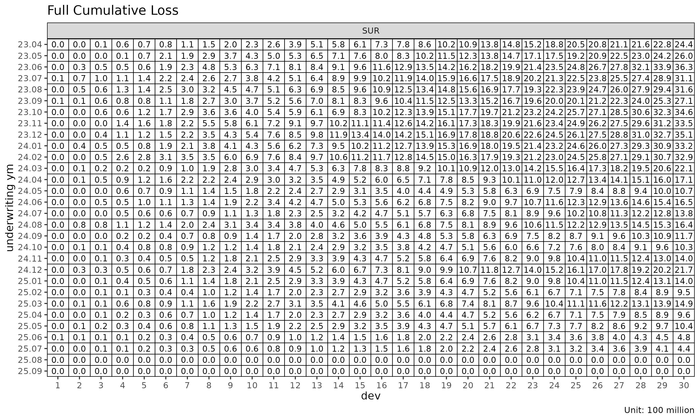

# Chain ladder reserving with fit_cl

[`fit_cl()`](https://seokhoonj.github.io/lossratio/reference/fit_cl.md)
is the dedicated chain ladder fit for a single value column. Unlike
[`fit_lr()`](https://seokhoonj.github.io/lossratio/reference/fit_lr.md)
(which projects loss / exposure jointly to get loss ratio),
[`fit_cl()`](https://seokhoonj.github.io/lossratio/reference/fit_cl.md)
projects one cumulative metric forward and computes Mack-style standard
errors per cohort.

## Basic usage

For brevity this vignette uses the `SUR` group only — every step
generalises to multi-group input.

``` r

library(lossratio)
data(experience)
exp <- as_experience(experience)
tri <- build_triangle(exp[cv_nm == "SUR"], group_var = cv_nm)

cl <- fit_cl(tri, value_var = "closs", method = "mack")
print(cl)
#> <CLFit>
#> method      : mack 
#> value_var   : closs 
#> weight_var  : none 
#> alpha       : 1 
#> sigma_method: min_last2 
#> recent      : all 
#> use_maturity: FALSE 
#> tail_factor : 1 
#> groups      : cv_nm 
#> periods     : 30
```

`value_var` selects the cumulative column to project — typically
`"closs"` (cumulative loss) for reserving, or `"crp"` (cumulative risk
premium) for exposure projection.

## Method: basic vs Mack

Two estimation methods are available:

| `method`  | What it computes                                    |
|-----------|-----------------------------------------------------|
| `"basic"` | Point projection only (selected age-to-age factors) |
| `"mack"`  | Point projection + factor / process / parameter SE  |

``` r

cl_basic <- fit_cl(tri, value_var = "closs", method = "basic")
cl_mack  <- fit_cl(tri, value_var = "closs", method = "mack")

names(cl_basic)
#>  [1] "call"          "data"          "method"        "group_var"    
#>  [5] "cohort_var"    "dev_var"       "value_var"     "full"         
#>  [9] "pred"          "ata"           "summary"       "factor"       
#> [13] "selected"      "maturity"      "alpha"         "sigma_method" 
#> [17] "weight_var"    "recent"        "use_maturity"  "maturity_args"
#> [21] "tail"          "tail_factor"

# Mack adds variance estimates to $full and $summary
head(cl_mack$summary)
#>     cv_nm     cohort     latest   ultimate   reserve     proc_se    param_se
#>    <char>     <Date>      <num>      <num>     <num>       <num>       <num>
#> 1:    SUR 2023-04-01 2442597071 2442597071         0         0.0         0.0
#> 2:    SUR 2023-05-01 2423543637 2600462323 176918686    270023.8    278555.7
#> 3:    SUR 2023-06-01 3211045456 3634951622 423906166    461673.6    481436.4
#> 4:    SUR 2023-07-01 2552396717 3106052722 553656005 217960839.9 130390124.8
#> 5:    SUR 2023-08-01 2472997731 3159902356 686904626 235800279.1 139803601.1
#> 6:    SUR 2023-09-01 2014222422 2712676355 698453933 230925350.4 124174149.4
#>             se           cv
#>          <num>        <num>
#> 1:         0.0 0.0000000000
#> 2:    387951.2 0.0001491855
#> 3:    667025.8 0.0001835034
#> 4: 253985260.2 0.0817710718
#> 5: 274129200.4 0.0867524276
#> 6: 262194082.4 0.0966551288
```

`method = "mack"` enables the projection plot’s confidence bands
(`show_interval = TRUE`):

``` r

plot(cl_mack, type = "projection", show_interval = TRUE)
```


## Tail factor

For triangles where the latest observed development period is still
developing, an extrapolated tail factor estimates ultimate:

``` r

# Log-linear extrapolation from the selected ata factors
cl_tail <- fit_cl(tri, value_var = "closs", method = "mack", tail = TRUE)

# Or supply a literal tail factor
cl_tail <- fit_cl(tri, value_var = "closs", method = "mack", tail = 1.025)
```

The extrapolation fits $`\log(f_k - 1) \sim k`$ to projected factors and
extends the projection by the cumulative product of extrapolated $`f_k`$
values. Disabled by default (`tail = FALSE`).

## Maturity filtering

If selected ata factors are volatile, restrict projection to the mature
region only:

``` r

cl_mat <- fit_cl(
  tri,
  value_var     = "closs",
  method        = "mack",
  maturity_args = list(cv_threshold = 0.10, rse_threshold = 0.05)
)

cl_mat$maturity
#> Key: <cv_nm>
#>     cv_nm ata_from ata_to ata_link  mean median    wt    cv     f  f_se   rse
#>    <char>    <num>  <num>   <char> <num>  <num> <num> <num> <num> <num> <num>
#> 1:    SUR        9     10     9-10 1.188  1.172 1.165 0.097 1.165 0.022 0.019
#>       sigma n_obs n_valid n_inf n_nan valid_ratio
#>       <num> <num>   <num> <num> <num>       <num>
#> 1: 1774.277    21      21     0     0           1
```

`maturity_args` is forwarded to
[`find_ata_maturity()`](https://seokhoonj.github.io/lossratio/reference/find_ata_maturity.md).

## Variance components (Mack)

`fit_cl(method = "mack")` decomposes the projection variance into:

- `proc_se` — process variance, from $`\sigma^2_k`$ (residual link
  variance per development period).
- `param_se` — parameter variance, from the uncertainty of the selected
  age-to-age factors $`\hat{f}_k`$.
- `se` — total standard error,
  $`\sqrt{\mathrm{proc\_se}^2 + \mathrm{param\_se}^2}`$.
- `cv` — coefficient of variation, `se / value_proj`.

``` r

summary(cl_mack)
#>      cv_nm     cohort     latest   ultimate    reserve      proc_se    param_se
#>     <char>     <Date>      <num>      <num>      <num>        <num>       <num>
#>  1:    SUR 2023-04-01 2442597071 2442597071          0          0.0         0.0
#>  2:    SUR 2023-05-01 2423543637 2600462323  176918686     270023.8    278555.7
#>  3:    SUR 2023-06-01 3211045456 3634951622  423906166     461673.6    481436.4
#>  4:    SUR 2023-07-01 2552396717 3106052722  553656005  217960839.9 130390124.8
#>  5:    SUR 2023-08-01 2472997731 3159902356  686904626  235800279.1 139803601.1
#>  6:    SUR 2023-09-01 2014222422 2712676355  698453933  230925350.4 124174149.4
#>  7:    SUR 2023-10-01 2422172261 3464336734 1042164472  276909538.5 163800531.4
#>  8:    SUR 2023-11-01 2157147627 3350616828 1193469201  347646647.3 180286628.2
#>  9:    SUR 2023-12-01 2062030049 3510350175 1448320126  379204806.3 195291841.3
#> 10:    SUR 2024-01-01 1803809923 3316423464 1512613541  371903392.6 185291187.4
#> 11:    SUR 2024-02-01 1627213163 3293904285 1666691122  406210630.0 191768889.0
#> 12:    SUR 2024-03-01 1006624217 2212909870 1206285654  348109440.4 131371151.8
#> 13:    SUR 2024-04-01  707083238 1712964997 1005881758  316686849.1 103164315.5
#> 14:    SUR 2024-05-01  398857315 1069653530  670796215  262671175.6  65778221.0
#> 15:    SUR 2024-06-01  558855275 1654603715 1095748440  342800640.1 103939643.6
#> 16:    SUR 2024-07-01  423131366 1378042291  954910925  336548944.8  89486749.5
#> 17:    SUR 2024-08-01  457705986 1642689619 1184983633  387322899.6 109347248.0
#> 18:    SUR 2024-09-01  278007657 1166380335  888372678  360265108.1  81491441.5
#> 19:    SUR 2024-10-01  214811383 1027414225  812602841  358796882.8  74015042.6
#> 20:    SUR 2024-11-01  251273978 1400108599 1148834621  451728996.7 105050621.5
#> 21:    SUR 2024-12-01  322678180 2168358641 1845680461  619598523.6 171876903.2
#> 22:    SUR 2025-01-01  179253480 1403314580 1224061099  523388231.9 114399770.2
#> 23:    SUR 2025-02-01  100816663  954214608  853397945  497168434.1  84734257.6
#> 24:    SUR 2025-03-01  111279088 1488227973 1376948885  843027250.9 163376032.7
#> 25:    SUR 2025-04-01   55914458  958667601  902753142  751897155.3 113958290.7
#> 26:    SUR 2025-05-01   41578392 1041506132  999927740  978637571.0 147793335.1
#> 27:    SUR 2025-06-01   14997311  484991120  469993808  813441066.4  81273400.9
#> 28:    SUR 2025-07-01    6232031  436725873  430493841 5630793730.4 495929947.1
#> 29:    SUR 2025-08-01          0          0          0          0.0         0.0
#> 30:    SUR 2025-09-01          0          0          0          0.0         0.0
#>      cv_nm     cohort     latest   ultimate    reserve      proc_se    param_se
#>     <char>     <Date>      <num>      <num>      <num>        <num>       <num>
#>               se           cv
#>            <num>        <num>
#>  1:          0.0 0.000000e+00
#>  2:     387951.2 1.491855e-04
#>  3:     667025.8 1.835034e-04
#>  4:  253985260.2 8.177107e-02
#>  5:  274129200.4 8.675243e-02
#>  6:  262194082.4 9.665513e-02
#>  7:  321728933.4 9.286884e-02
#>  8:  391613916.6 1.168782e-01
#>  9:  426538613.0 1.215089e-01
#> 10:  415505664.9 1.252873e-01
#> 11:  449201939.7 1.363737e-01
#> 12:  372073328.8 1.681376e-01
#> 13:  333066714.6 1.944387e-01
#> 14:  270782054.1 2.531493e-01
#> 15:  358211848.4 2.164940e-01
#> 16:  348242832.8 2.527084e-01
#> 17:  402462233.3 2.450020e-01
#> 18:  369366759.6 3.166778e-01
#> 19:  366351511.0 3.565762e-01
#> 20:  463783052.2 3.312479e-01
#> 21:  642996112.2 2.965359e-01
#> 22:  535744854.1 3.817710e-01
#> 23:  504337532.1 5.285368e-01
#> 24:  858712218.3 5.770031e-01
#> 25:  760483940.8 7.932718e-01
#> 26:  989734492.3 9.502916e-01
#> 27:  817491121.8 1.685580e+00
#> 28: 5652590958.7 1.294311e+01
#> 29:          0.0           NA
#> 30:          0.0           NA
#>               se           cv
#>            <num>        <num>
```

## Reserve plot

`type = "reserve"` shows reserve per cohort with optional error bars
(Mack only):

``` r

plot(cl_mack, type = "reserve", conf_level = 0.95)
```


## Triangle visualisation

[`plot_triangle()`](https://seokhoonj.github.io/lossratio/reference/plot_triangle.md)
displays the cohort × dev cells as a heatmap, distinguishing observed
cells from projected:

``` r

plot_triangle(cl_mack, what = "full")    # observed + projected
```



``` r

plot_triangle(cl_mack, what = "pred")    # projected only
```


``` r

plot_triangle(cl_mack, what = "data")    # observed only
```


The `label_style = "cv"` mode shows coefficient of variation per cell,
useful for spotting unreliable cells:

``` r

plot_triangle(cl_mack, label_style = "cv")
```


``` r

plot_triangle(cl_mack, label_style = "se")
```


``` r

plot_triangle(cl_mack, label_style = "ci")
```


## Sigma extrapolation methods

Mack variance requires $`\sigma_k`$ at all development links, including
the last where it cannot be estimated directly. `sigma_method` controls
the extrapolation:

| `sigma_method` | Behaviour |
|----|----|
| `"min_last2"` | (default) min of the last two estimable $`\sigma`$ values — conservative |
| `"locf"` | Last observation carried forward |
| `"loglinear"` | Log-linear extrapolation from the observed $`\sigma_k`$ sequence |

``` r

fit_cl(tri, value_var = "closs", method = "mack", sigma_method = "loglinear")
#> <CLFit>
#> method      : mack 
#> value_var   : closs 
#> weight_var  : none 
#> alpha       : 1 
#> sigma_method: loglinear 
#> recent      : all 
#> use_maturity: FALSE 
#> tail_factor : 1 
#> groups      : cv_nm 
#> periods     : 30
```

## See also

- [`vignette("loss-ratio-methods")`](https://seokhoonj.github.io/lossratio/articles/loss-ratio-methods.md)
  — when to use
  [`fit_lr()`](https://seokhoonj.github.io/lossratio/reference/fit_lr.md)
  instead.
- [`vignette("triangle-diagnostics")`](https://seokhoonj.github.io/lossratio/articles/triangle-diagnostics.md)
  — [`summary()`](https://rdrr.io/r/base/summary.html),
  [`find_ata_maturity()`](https://seokhoonj.github.io/lossratio/reference/find_ata_maturity.md),
  ata diagnostic plots.
- [`?fit_cl`](https://seokhoonj.github.io/lossratio/reference/fit_cl.md),
  [`?find_ata_maturity`](https://seokhoonj.github.io/lossratio/reference/find_ata_maturity.md),
  [`?fit_ata`](https://seokhoonj.github.io/lossratio/reference/fit_ata.md).
