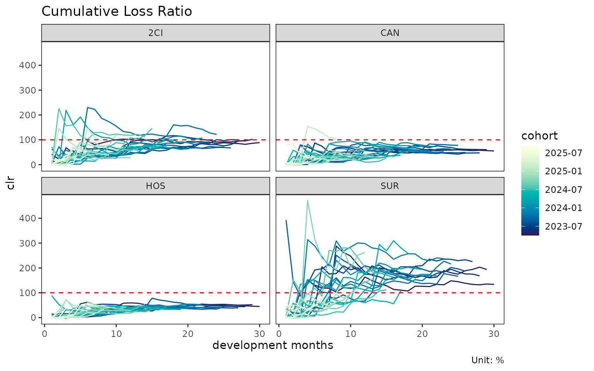
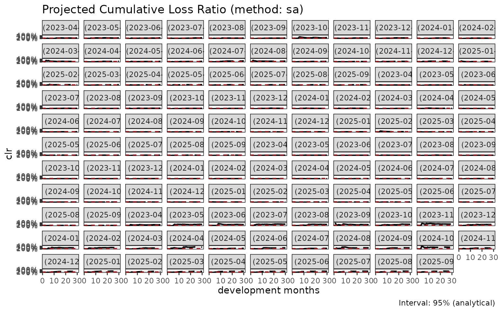

# lossratio 시작하기

> 영어 원본 보기: [Getting started with
> lossratio](https://seokhoonj.github.io/lossratio/getting-started.md)

이 vignette 은 `lossratio` 의 전체 파이프라인을 내장 합성 experience
데이터 위에서 따라간다. raw long-format 행에서 시작하여 적합된 손해율
추정까지 이어진다.

## 입력 형태

`lossratio` 는 long-format experience 데이터를 입력으로 사용한다 — 한
행은 (코호트 × 경과 기간 × 인구통계) 셀 하나에 대응한다. 내장 데이터셋
`experience` 는 33,381 행 테이블로, 여러 단위의 calendar / underwriting
기간 컬럼, 인구통계 차원 (`cv_nm`, `age_band`, `gender`), 금액 컬럼
(`loss`, `rp`) 을 포함한다.

``` r

library(lossratio)

data(experience)
str(experience)
#> Classes 'data.table' and 'data.frame':   33480 obs. of  17 variables:
#>  $ cy      : Date, format: "2023-01-01" "2023-01-01" ...
#>  $ cyh     : Date, format: "2023-01-01" "2023-01-01" ...
#>  $ cyq     : Date, format: "2023-04-01" "2023-04-01" ...
#>  $ cym     : Date, format: "2023-04-01" "2023-04-01" ...
#>  $ uy      : Date, format: "2023-01-01" "2023-01-01" ...
#>  $ uyh     : Date, format: "2023-01-01" "2023-01-01" ...
#>  $ uyq     : Date, format: "2023-04-01" "2023-04-01" ...
#>  $ uym     : Date, format: "2023-04-01" "2023-04-01" ...
#>  $ elap_y  : int  1 1 1 1 1 1 1 1 1 1 ...
#>  $ elap_h  : int  1 1 1 1 1 1 1 1 1 1 ...
#>  $ elap_q  : int  1 1 1 1 1 1 1 1 1 1 ...
#>  $ elap_m  : int  1 1 1 1 1 1 1 1 1 1 ...
#>  $ cv_nm   : chr  "SUR" "SUR" "SUR" "SUR" ...
#>  $ age_band: Ord.factor w/ 9 levels "30-34"<"35-39"<..: 1 1 2 2 3 3 4 4 5 5 ...
#>  $ gender  : Factor w/ 2 levels "M","F": 1 2 1 2 1 2 1 2 1 2 ...
#>  $ loss    : num  0 0 0 0 0 0 0 0 0 0 ...
#>  $ rp      : num  3555865 258448 255420 464313 92744 ...
#>  - attr(*, ".internal.selfref")=<pointer: (nil)>
```

## 1단계 — 검증 및 코어션

``` r

exp <- as_experience(experience)
class(exp)
#> [1] "experience" "data.table" "data.frame"
```

[`as_experience()`](https://seokhoonj.github.io/lossratio/reference/as_experience.md)
는 필수 컬럼 (`cym`, `uym`, `loss`, `rp`) 의 존재를 확인하고, 날짜
컬럼을 코어션하며, 클래스를 부여한다. 변형 없이 검증만 필요하면
`check_experience(df)` 를 사용한다.

## 2단계 — 코호트 × 경과 기간 구조 구축

``` r

tri <- build_triangle(exp, group_var = cv_nm)
class(tri)
#> [1] "triangle"   "data.table" "data.frame"
names(tri)
#>  [1] "cv_nm"      "n_obs"      "cohort"     "dev"        "loss"      
#>  [6] "rp"         "closs"      "crp"        "margin"     "cmargin"   
#> [11] "profit"     "cprofit"    "lr"         "clr"        "loss_prop" 
#> [16] "rp_prop"    "closs_prop" "crp_prop"
```

[`build_triangle()`](https://seokhoonj.github.io/lossratio/reference/build_triangle.md)
의 동작:

- 인구통계 차원을 집계하여 제거한다 (여기서는 `age_band`, `gender`),
- 누적 컬럼 (`closs`, `crp`) 을 추가한다,
- 파생 지표 (`margin`, `lr`, `clr`, 비율) 를 추가한다,
- 코호트 / 경과 기간 컬럼을 표준명 `cohort` 와 `dev` 로 rename 한다,
- 원본 컬럼명은 attribute (`cohort_var`, `dev_var`) 로 보존하여 하위
  plot 라벨에서 활용 가능하게 한다.

## 3단계 — 진단

``` r

plot(tri)              # 코호트별 clr 궤적
```



``` r

plot_triangle(tri)     # clr 셀의 heatmap
```


``` r

summary(tri)           # 경과 기간별 그룹 통계량
#> Key: <cv_nm, dev>
#>       cv_nm   dev n_obs    lr_mean    lr_median      lr_wt   clr_mean
#>      <char> <int> <int>      <num>        <num>      <num>      <num>
#>   1:    2CI     1    30 0.07682952 0.0000684217 0.09346191 0.07682952
#>   2:    2CI     2    29 0.31682799 0.0002658639 0.37921332 0.21699608
#>   3:    2CI     3    28 0.46725413 0.1418544378 0.43601945 0.33392280
#>   4:    2CI     4    27 0.64199653 0.5374941298 0.61222448 0.45737038
#>   5:    2CI     5    26 0.64809352 0.2890663538 0.65077672 0.50492686
#>  ---                                                                 
#> 116:    SUR    26     5 1.64442416 0.8460267510 1.63425346 1.84602199
#> 117:    SUR    27     4 1.55040105 1.3316006307 1.45324974 1.82084165
#> 118:    SUR    28     3 1.97389029 1.0646915297 1.60414765 1.67851251
#> 119:    SUR    29     2 1.08484998 1.0848499790 1.12970250 1.64509820
#> 120:    SUR    30     1 1.14559716 1.1455971598 1.14559716 1.33809709
#>        clr_median     clr_wt
#>             <num>      <num>
#>   1: 0.0000684217 0.09346191
#>   2: 0.0274751765 0.25081620
#>   3: 0.1477140322 0.33811373
#>   4: 0.3862054651 0.43323143
#>   5: 0.3658265200 0.49590320
#>  ---                        
#> 116: 1.8691337277 1.85029703
#> 117: 1.8463935163 1.82648276
#> 118: 1.6839090669 1.67155820
#> 119: 1.6450981981 1.63511904
#> 120: 1.3380970917 1.33809709
```

## 4단계 — 경과 기간 모형화

코호트 발달을 보는 두 가지 상호 보완적 관점.

``` r

# 연속 발달비(age-to-age) 인자
ata <- build_ata(tri, value_var = "closs")
fit_ata(ata)
#> <ata_fit>
#> alpha       : 1 
#> sigma_method: min_last2 
#> recent      : all 
#> use_maturity: FALSE 
#> groups      : cv_nm 
#> n_groups    : 4 
#> ata links   : 116

# 노출 기반(exposure-driven) 강도
ed <- build_ed(tri, loss_var = "closs", exposure_var = "crp")
fit_ed(ed)
#> <ed_fit>
#> method      : basic 
#> loss_var    : closs 
#> exposure_var: crp 
#> alpha       : 1 
#> sigma_method: min_last2 
#> recent      : all 
#> groups      : cv_nm 
#> n_groups    : 4 
#> links       : 116
```

[`fit_ata()`](https://seokhoonj.github.io/lossratio/reference/fit_ata.md)
는 경과 기간 링크별로 선택된 age-to-age 인자를 반환한다.
[`fit_ed()`](https://seokhoonj.github.io/lossratio/reference/fit_ed.md)
는 강도 인자 $`g_k = \Delta C^L_k / C^P_k`$ 를 반환한다. 두 출력 모두
아래 추정 방법의 입력으로 사용된다.

## 5단계 — 추정

[`fit_cl()`](https://seokhoonj.github.io/lossratio/reference/fit_cl.md)
은 chain ladder 추정을 수행한다.

``` r

cl <- fit_cl(tri, value_var = "closs", method = "mack")
plot(cl, type = "projection")
#> `geom_line()`: Each group consists of only one observation.
#> ℹ Do you need to adjust the group aesthetic?
#> `geom_line()`: Each group consists of only one observation.
#> ℹ Do you need to adjust the group aesthetic?
#> `geom_line()`: Each group consists of only one observation.
#> ℹ Do you need to adjust the group aesthetic?
#> `geom_line()`: Each group consists of only one observation.
#> ℹ Do you need to adjust the group aesthetic?
#> Warning: Removed 1 row containing missing values or values outside the scale range
#> (`geom_segment()`).
#> Removed 1 row containing missing values or values outside the scale range
#> (`geom_segment()`).
#> Removed 1 row containing missing values or values outside the scale range
#> (`geom_segment()`).
#> Removed 1 row containing missing values or values outside the scale range
#> (`geom_segment()`).
#> `geom_line()`: Each group consists of only one observation.
#> ℹ Do you need to adjust the group aesthetic?
#> `geom_line()`: Each group consists of only one observation.
#> ℹ Do you need to adjust the group aesthetic?
#> `geom_line()`: Each group consists of only one observation.
#> ℹ Do you need to adjust the group aesthetic?
#> `geom_line()`: Each group consists of only one observation.
#> ℹ Do you need to adjust the group aesthetic?
```


``` r

summary(cl)
#>       cv_nm     cohort     latest   ultimate    reserve     proc_se   param_se
#>      <char>     <Date>      <num>      <num>      <num>       <num>      <num>
#>   1:    2CI 2023-04-01 1769961365 1769961365          0           0          0
#>   2:    2CI 2023-05-01 2177258013 2408047363  230789349    81021770   94495076
#>   3:    2CI 2023-06-01 2004054588 2522359218  518304630   111885319  114904860
#>   4:    2CI 2023-07-01 1740086803 2284297217  544210414   115767968  107391009
#>   5:    2CI 2023-08-01 1020729631 1487357605  466627974   209491141  103506080
#>  ---                                                                          
#> 116:    SUR 2025-05-01   79474575 2873248566 2793773992  4722987523  809706186
#> 117:    SUR 2025-06-01   44351381 2365070816 2320719436  7190998494 1055891775
#> 118:    SUR 2025-07-01   12461511 2312527756 2300066245 20431127319 2852680795
#> 119:    SUR 2025-08-01          0          0          0           0          0
#> 120:    SUR 2025-09-01          0          0          0           0          0
#>               se         cv
#>            <num>      <num>
#>   1:           0 0.00000000
#>   2:   124474280 0.05169096
#>   3:   160379087 0.06358297
#>   4:   157908363 0.06912777
#>   5:   233666529 0.15710178
#>  ---                       
#> 116:  4791892659 1.66776126
#> 117:  7268106134 3.07310296
#> 118: 20629317760 8.92067899
#> 119:           0         NA
#> 120:           0         NA
```

[`fit_lr()`](https://seokhoonj.github.io/lossratio/reference/fit_lr.md)
은 손해율 추정을 수행한다. 기본값 `method = "sa"` (단계
적응적(stage-adaptive)) 는 성숙점(maturity point) 이전에는 노출 기반
방식, 성숙점 이후에는 chain ladder 를 적용한다. 전환 지점은 ata 인자에서
그룹별로 탐지된 성숙점이다.

``` r

lr <- fit_lr(tri, method = "sa")
plot(lr, type = "clr")
#> `geom_line()`: Each group consists of only one observation.
#> ℹ Do you need to adjust the group aesthetic?
#> `geom_line()`: Each group consists of only one observation.
#> ℹ Do you need to adjust the group aesthetic?
#> `geom_line()`: Each group consists of only one observation.
#> ℹ Do you need to adjust the group aesthetic?
#> `geom_line()`: Each group consists of only one observation.
#> ℹ Do you need to adjust the group aesthetic?
#> Warning: Removed 1 row containing missing values or values outside the scale range
#> (`geom_segment()`).
#> Removed 1 row containing missing values or values outside the scale range
#> (`geom_segment()`).
#> Removed 1 row containing missing values or values outside the scale range
#> (`geom_segment()`).
#> Removed 1 row containing missing values or values outside the scale range
#> (`geom_segment()`).
#> `geom_line()`: Each group consists of only one observation.
#> ℹ Do you need to adjust the group aesthetic?
#> `geom_line()`: Each group consists of only one observation.
#> ℹ Do you need to adjust the group aesthetic?
#> `geom_line()`: Each group consists of only one observation.
#> ℹ Do you need to adjust the group aesthetic?
#> `geom_line()`: Each group consists of only one observation.
#> ℹ Do you need to adjust the group aesthetic?
```



``` r

summary(lr)
#>       cv_nm     cohort     latest   ultimate    reserve exposure_ult clr_latest
#>      <char>     <Date>      <num>      <num>      <num>        <num>      <num>
#>   1:    2CI 2023-04-01 1769961365 1769961365          0   1991886535  0.8885854
#>   2:    2CI 2023-05-01 2177258013 2408047363  230789349   2284418174  1.0198072
#>   3:    2CI 2023-06-01 2004054588 2522359218  518304630   2375671198  0.9676132
#>   4:    2CI 2023-07-01 1740086803 2284297217  544210414   2091234898  0.9992941
#>   5:    2CI 2023-08-01 1020729631 1487357605  466627974   1933805836  0.6725715
#>  ---                                                                           
#> 116:    SUR 2025-05-01   79474575 5330755348 5251280773   3170694512  0.5208363
#> 117:    SUR 2025-06-01   44351381 4669095782 4624744401   2746665433  0.4418904
#> 118:    SUR 2025-07-01   12461511 6405537028 6393075517   3705335918  0.1463368
#> 119:    SUR 2025-08-01          0 5151619396 5151619396   2969197221  0.0000000
#> 120:    SUR 2025-09-01          0 5216378154 5216378154   2995415278  0.0000000
#>        clr_ult maturity_from    proc_se  param_se         se         cv
#>          <num>         <num>      <num>     <num>      <num>      <num>
#>   1: 0.8885854            18          0         0          0 0.00000000
#>   2: 1.0541185            18   81021770  94495076  124474280 0.05169096
#>   3: 1.0617459            18  111885319 114904860  160379087 0.06358297
#>   4: 1.0923198            18  115767968 107391009  157908363 0.06912777
#>   5: 0.7691349            18  209491141 103506080  233666529 0.15710178
#>  ---                                                                   
#> 116: 1.6812579            15 2441571165 725982384 2547218125 0.47783437
#> 117: 1.6999143            15 2282292178 633588616 2368605523 0.50729427
#> 118: 1.7287331            15 2692258007 868125300 2828762046 0.44161200
#> 119: 1.7350210            15 2413061918 697300804 2511791439 0.48757318
#> 120: 1.7414541            15 2425838047 705030372 2526214175 0.48428509
#>          se_clr     cv_clr    ci_lower  ci_upper
#>           <num>      <num>       <num>     <num>
#>   1: 0.00000000 0.00000000 0.888585436 0.8885854
#>   2: 0.05448840 0.05169096 0.947323166 1.1609138
#>   3: 0.06750896 0.06358297 0.929430801 1.1940611
#>   4: 0.07550963 0.06912777 0.944323622 1.2403159
#>   5: 0.12083247 0.15710178 0.532307642 1.0059622
#>  ---                                            
#> 116: 0.80336283 0.47783437 0.106695729 3.2558202
#> 117: 0.86235677 0.50729427 0.009726071 3.3901025
#> 118: 0.76342931 0.44161200 0.232439195 3.2250271
#> 119: 0.84594968 0.48757318 0.076990049 3.3930519
#> 120: 0.84336025 0.48428509 0.088498365 3.3944098
```

## 6단계 — 구조 변화 진단

[`detect_cohort_regime()`](https://seokhoonj.github.io/lossratio/reference/detect_cohort_regime.md)
은 최근 코호트가 이전 코호트와 다르게 행동하는지 검사한다. 동질적
부분집합에 한하여 손해율 적합을 수행하기 위한 전처리 단계로 활용된다.

``` r

sub <- build_triangle(exp[cv_nm == "SUR"], group_var = cv_nm)
detect_cohort_regime(sub, K = 12, method = "ecp")
#> <cohort_regime>
#>   method      : ecp
#>   value_var   : clr
#>   window (K)  : elap_m 1, ..., 12
#>   cohorts     : 19 analysed (11 dropped)
#>   regimes     : 1
#>   breakpoints : (none)
#>   PC1 / PC2   : 58.2% / 16.5%
```

상세 설명은
[`vignette("regime-detection")`](https://seokhoonj.github.io/lossratio/articles/regime-detection.md)
을 참고한다.

## 다음 단계

- [`vignette("aggregation-frameworks")`](https://seokhoonj.github.io/lossratio/articles/aggregation-frameworks.md)
  — `build_triangle`, `build_calendar`, `build_total` 의 사용 시점 비교.
- [`vignette("loss-ratio-methods")`](https://seokhoonj.github.io/lossratio/articles/loss-ratio-methods.md)
  —
  [`fit_lr()`](https://seokhoonj.github.io/lossratio/reference/fit_lr.md)
  에서 `"sa"` / `"ed"` / `"cl"` 중 선택 기준.
- [`vignette("chain-ladder")`](https://seokhoonj.github.io/lossratio/articles/chain-ladder.md)
  —
  [`fit_cl()`](https://seokhoonj.github.io/lossratio/reference/fit_cl.md)
  심층 해설 (Mack 분산, tail factor).
- [`vignette("triangle-diagnostics")`](https://seokhoonj.github.io/lossratio/articles/triangle-diagnostics.md)
  —
  [`summary_ata()`](https://seokhoonj.github.io/lossratio/reference/summary_ata.md),
  [`find_ata_maturity()`](https://seokhoonj.github.io/lossratio/reference/find_ata_maturity.md),
  triangle 형식의 시각화.
- [`vignette("regime-detection")`](https://seokhoonj.github.io/lossratio/articles/regime-detection.md)
  —
  [`detect_cohort_regime()`](https://seokhoonj.github.io/lossratio/reference/detect_cohort_regime.md)
  을 통한 코호트 간 구조 변화 진단.
- [`vignette("backtest")`](https://seokhoonj.github.io/lossratio/articles/backtest.md)
  — `fit_cl` 또는 `fit_lr` 을 사용한 대각선 홀드아웃(holdout) 검증.
