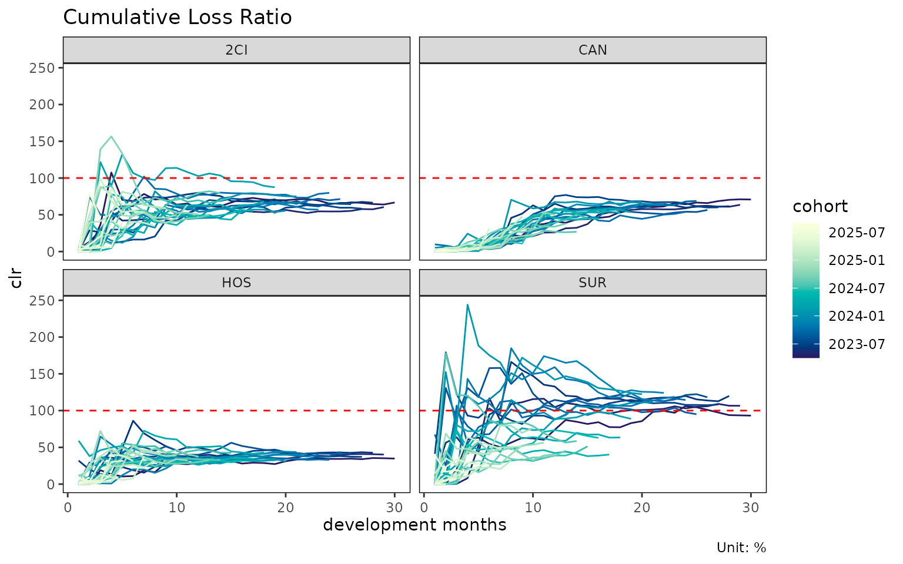
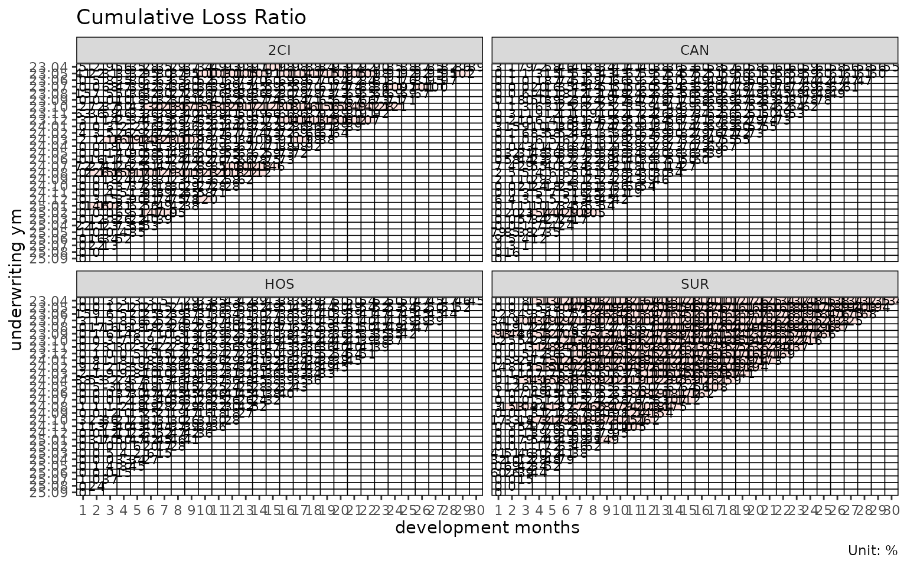
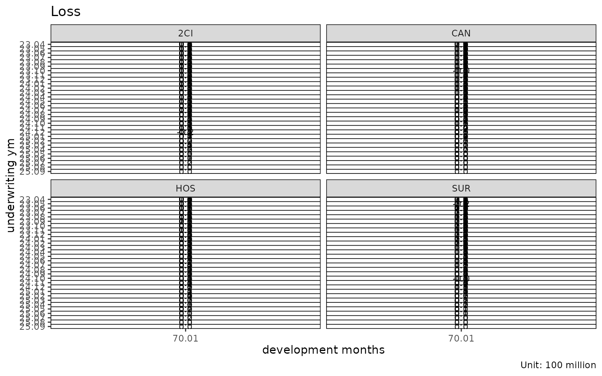
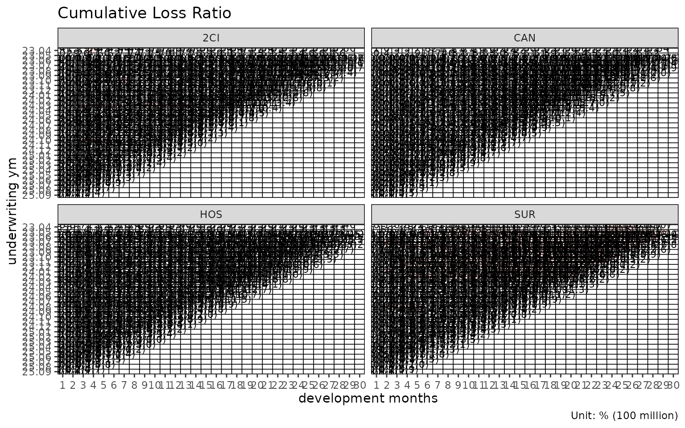
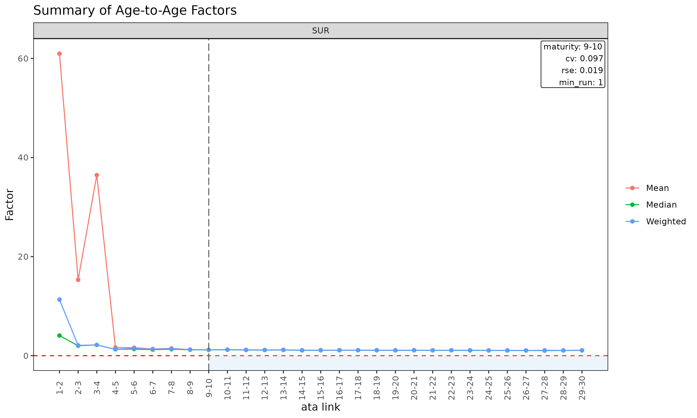
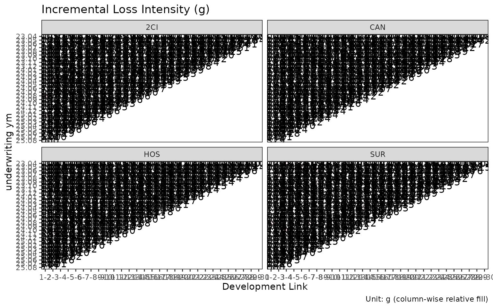

# Triangle and ata diagnostics

Before fitting a chain ladder or loss-ratio model, it pays to inspect
the underlying triangle. This vignette covers the diagnostic tools in
`lossratio` for understanding cohort behaviour, age-to-age factor
stability, and maturity detection.

## Triangle-level diagnostics

``` r

library(lossratio)
data(experience)
exp <- as_experience(experience)
tri <- build_triangle(exp, group_var = cv_nm)
```

### Cohort trajectories

``` r

plot(tri)                              # raw clr trajectories per cohort
```



``` r

plot(tri, value_var = "loss")          # cumulative loss instead of clr
```


``` r

plot(tri, summary = TRUE)              # raw + overlay (mean / median / weighted)
```


The `summary = TRUE` overlay computes mean, median, and weighted clr at
each dev and overlays them on the cohort lines. Useful for spotting
cohorts that deviate from the central tendency.

### Cell heatmap

``` r

plot_triangle(tri)                          # clr in each cell
```



``` r

plot_triangle(tri, value_var = "loss")      # cumulative loss
```



``` r

plot_triangle(tri, label_style = "detail")  # ratio + (loss / rp) amounts
```



### Group statistics by dev

``` r

sm <- summary(tri)
head(sm)
#> Key: <cv_nm, dev>
#>     cv_nm   dev n_obs    lr_mean    lr_median      lr_wt   clr_mean
#>    <char> <int> <int>      <num>        <num>      <num>      <num>
#> 1:    2CI     1    30 0.07682952 0.0000684217 0.09346191 0.07682952
#> 2:    2CI     2    29 0.31682799 0.0002658639 0.37921332 0.21699608
#> 3:    2CI     3    28 0.46725413 0.1418544378 0.43601945 0.33392280
#> 4:    2CI     4    27 0.64199653 0.5374941298 0.61222448 0.45737038
#> 5:    2CI     5    26 0.64809352 0.2890663538 0.65077672 0.50492686
#> 6:    2CI     6    25 1.00328576 0.4230790053 1.05243689 0.63430163
#>      clr_median     clr_wt
#>           <num>      <num>
#> 1: 0.0000684217 0.09346191
#> 2: 0.0274751765 0.25081620
#> 3: 0.1477140322 0.33811373
#> 4: 0.3862054651 0.43323143
#> 5: 0.3658265200 0.49590320
#> 6: 0.4266323751 0.63494667
```

Returns a `triangle_summary` object with mean / median / weighted loss
ratios per (group, dev) cell.

## Age-to-age factor diagnostics

``` r

ata <- build_ata(tri, value_var = "closs")
sm  <- summary_ata(ata, alpha = 1)
head(sm)
#> Key: <cv_nm>
#>     cv_nm ata_from ata_to ata_link      mean median    wt    cv     f   f_se
#>    <char>    <num>  <num>   <fctr>     <num>  <num> <num> <num> <num>  <num>
#> 1:    2CI        1      2      1-2 34274.413  1.026 5.709 3.984 4.008 69.971
#> 2:    2CI        2      3      2-3    40.708  2.852 2.281 2.795 2.027  3.353
#> 3:    2CI        3      4      3-4    32.952  2.349 1.890 3.737 1.781  0.896
#> 4:    2CI        4      5      4-5     2.937  1.350 1.646 2.115 1.646  0.373
#> 5:    2CI        5      6      5-6     2.810  1.308 1.791 1.278 1.791  0.356
#> 6:    2CI        6      7      6-7     1.324  1.189 1.225 0.353 1.225  0.068
#>       rse      sigma n_obs n_valid n_inf n_nan valid_ratio
#>     <num>      <num> <num>   <num> <num> <num>       <num>
#> 1: 17.460 412335.337    29      16     0     0       0.552
#> 2:  1.655  47209.055    28      22     0     0       0.786
#> 3:  0.503  18961.582    27      26     0     0       0.963
#> 4:  0.227  10617.916    26      26     0     0       1.000
#> 5:  0.199  12597.734    25      25     0     0       1.000
#> 6:  0.056   3169.431    24      24     0     0       1.000
```

[`summary_ata()`](https://seokhoonj.github.io/lossratio/reference/summary_ata.md)
computes per-link statistics that drive maturity detection:

- `mean`, `median`, `wt` — descriptive averages of observed ata factors
  at each link (excluding cohorts where the link is not observed).
- `cv` — coefficient of variation of the observed factors (relative
  spread, alpha-independent).
- `f` — WLS-estimated factor (volume-weighted by `value_from^alpha`).
- `f_se`, `rse` — WLS standard error and relative standard error.
- `sigma` — Mack residual sigma per link.
- `n_obs`, `n_valid`, `n_inf`, `n_nan`, `valid_ratio` — observation
  counts and the share of finite ata factors per link.

### Diagnostic plots for `ata`

``` r

plot(ata, type = "cv")            # CV vs ata link with maturity overlay
```


``` r

plot(ata, type = "rse")           # RSE vs ata link
```


``` r

plot(ata, type = "summary")       # mean / median / wt overlay per link
```



``` r

plot(ata, type = "box")           # boxplot of observed ata per link
```


``` r

plot(ata, type = "point")         # scatter of observed ata per link
```


### Triangle of ata factors

``` r

plot_triangle(ata)                                # heatmap of observed factors
```


``` r

plot_triangle(ata, label_style = "detail")        # factor + (loss / rp) amounts
```


``` r

plot_triangle(ata, show_maturity = TRUE)          # overlay maturity line
```


The heatmap colours each cell by `log(ata / median(ata))` within its
link, so column-wise colour distinguishes cohorts that deviate from the
link’s median.

## Maturity detection

The maturity point is the development link beyond which age-to-age
factors are stable enough to trust for chain-ladder projection. Used
internally by `fit_lr(method = "sa")` to switch from ED to CL.

[`find_ata_maturity()`](https://seokhoonj.github.io/lossratio/reference/find_ata_maturity.md)
operates on a
[`summary_ata()`](https://seokhoonj.github.io/lossratio/reference/summary_ata.md)
object — first build the descriptive / WLS summary, then probe it for
the first mature link:

``` r

sm  <- summary_ata(ata, alpha = 1)
mat <- find_ata_maturity(
  sm,
  cv_threshold    = 0.10,    # CV must be below this
  rse_threshold   = 0.05,    # RSE must be below this
  min_valid_ratio = 0.5,     # at least 50% finite cohorts at the link
  min_n_valid     = 3L,      # at least 3 finite cohorts
  min_run         = 1L       # at least 1 consecutive mature link
)

print(mat)
#> Key: <cv_nm>
#>     cv_nm ata_from ata_to ata_link  mean median    wt    cv     f  f_se   rse
#>    <char>    <num>  <num>   <char> <num>  <num> <num> <num> <num> <num> <num>
#> 1:    2CI       18     19    18-19 1.076  1.047 1.076 0.055 1.076 0.017 0.016
#> 2:    CAN       17     18    17-18 1.137  1.119 1.126 0.093 1.126 0.027 0.024
#> 3:    HOS       17     18    17-18 1.107  1.092 1.101 0.054 1.101 0.018 0.016
#> 4:    SUR       15     16    15-16 1.092  1.038 1.098 0.094 1.098 0.027 0.025
#>       sigma n_obs n_valid n_inf n_nan valid_ratio
#>       <num> <num>   <num> <num> <num>       <num>
#> 1: 1650.456    12      12     0     0           1
#> 2: 2473.092    13      13     0     0           1
#> 3: 1350.950    13      13     0     0           1
#> 4: 4057.711    15      15     0     0           1
```

A row per group with the first development link satisfying all
thresholds, carrying the link’s full statistics. The threshold arguments
are also stored as attributes on the returned object.
[`find_ata_maturity()`](https://seokhoonj.github.io/lossratio/reference/find_ata_maturity.md)
is also called internally by
[`fit_ata()`](https://seokhoonj.github.io/lossratio/reference/fit_ata.md)
and
[`fit_cl()`](https://seokhoonj.github.io/lossratio/reference/fit_cl.md)
when `maturity_args` is supplied (the `alpha` of the internal
[`summary_ata()`](https://seokhoonj.github.io/lossratio/reference/summary_ata.md)
step is taken from those callers).

Tune the thresholds to your portfolio’s volatility profile. Tight
thresholds (e.g. `cv_threshold = 0.05`) push maturity later; loose
thresholds push it earlier.

## ED diagnostics

``` r

ed <- build_ed(tri, loss_var = "closs", exposure_var = "crp")
sm <- summary_ed(ed, alpha = 1)
head(sm)
#> Key: <cv_nm>
#>     cv_nm ata_from ata_to ata_link    mean  median      wt      cv       g
#>    <char>    <num>  <num>   <fctr>   <num>   <num>   <num>   <num>   <num>
#> 1:    2CI        1      2      1-2 0.43017 0.00025 0.45524 2.85861 0.45524
#> 2:    2CI        2      3      2-3 0.34713 0.13068 0.33637 2.20434 0.33637
#> 3:    2CI        3      4      3-4 0.33564 0.27159 0.30584 1.01829 0.30584
#> 4:    2CI        4      5      4-5 0.28380 0.10896 0.27756 1.39025 0.27756
#> 5:    2CI        5      6      5-6 0.38135 0.11079 0.38237 1.72311 0.38237
#> 6:    2CI        6      7      6-7 0.14598 0.10207 0.14379 1.12284 0.14379
#>       g_se     rse    sigma n_obs n_valid n_inf n_nan valid_ratio
#>      <num>   <num>    <num> <num>   <num> <num> <num>       <num>
#> 1: 0.24492 0.53801 4641.876    29      29     0     0           1
#> 2: 0.13535 0.40238 3719.065    28      28     0     0           1
#> 3: 0.06214 0.20318 2242.307    27      27     0     0           1
#> 4: 0.07533 0.27141 3266.851    26      26     0     0           1
#> 5: 0.13019 0.34048 6627.107    25      25     0     0           1
#> 6: 0.03288 0.22867 1917.319    24      24     0     0           1

plot(ed, type = "summary")
```


``` r

plot(ed, type = "box")
```


``` r

plot_triangle(ed)
```



[`summary_ed()`](https://seokhoonj.github.io/lossratio/reference/summary_ed.md)
is the ED-side analogue of
[`summary_ata()`](https://seokhoonj.github.io/lossratio/reference/summary_ata.md),
computing per-link statistics for the intensity
$`g_k = \Delta C^L_k / C^P_k`$.

## Validation before building

If gaps in the development sequence are suspected, inspect them before
[`build_triangle()`](https://seokhoonj.github.io/lossratio/reference/build_triangle.md):

``` r

gaps <- validate_triangle(exp, group_var = cv_nm,
                          cohort_var = "uym", dev_var = "elap_m")
head(gaps)
#> Empty data.table (0 rows and 5 cols): cv_nm,uym,n_observed,n_expected,missing
```

Returns a `triangle_validation` object with one row per cohort that has
non-consecutive development periods. An empty result means the triangle
is clean.

If gaps exist, options:

- Fix the data source (preferred).
- Drop offending cohorts.
- Pass `fill_gaps = TRUE` to
  [`build_triangle()`](https://seokhoonj.github.io/lossratio/reference/build_triangle.md)
  to zero-fill missing cells (use with care — inflates `n_obs`).

## Recent-diagonal subset

When older cohorts are no longer representative (rate change, reserving
regime shift), restrict estimation to the recent calendar diagonals:

``` r

fit_ata(ata, alpha = 1, recent = 12)        # last 12 calendar diagonals
#> <ata_fit>
#> alpha       : 1 
#> sigma_method: min_last2 
#> recent      : 12 
#> use_maturity: FALSE 
#> groups      : cv_nm 
#> n_groups    : 4 
#> ata links   : 116
fit_cl(tri, value_var = "closs", recent = 12)
#> <cl_fit>
#> method      : basic 
#> value_var   : closs 
#> weight_var  : none 
#> alpha       : 1 
#> recent      : 12 
#> use_maturity: FALSE 
#> tail_factor : 1 
#> groups      : cv_nm 
#> periods     : 30
fit_lr(tri, recent = 12)
#> <lr_fit>
#> method        : sa 
#> loss_var      : closs 
#> exposure_var  : crp 
#> loss_alpha    : 1 
#> exposure_alpha: 1 
#> delta_method  : simple 
#> conf_level    : 0.95 
#> ci_type       : analytical  
#> sigma_method  : min_last2 
#> recent        : 12 
#> maturity[2CI] : 18
#> maturity[CAN] : 18
#> maturity[HOS] : 18
#> maturity[SUR] : 19
#> groups        : cv_nm 
#> periods       : 120
```

`recent = K` keeps only rows whose calendar position
(`rank(cohort) + dev - 1`) is among the latest `K` per group.

## Workflow checklist

Before fitting:

1.  [`validate_triangle()`](https://seokhoonj.github.io/lossratio/reference/validate_triangle.md)
    — schema and gap check.
2.  [`build_triangle()`](https://seokhoonj.github.io/lossratio/reference/build_triangle.md)
    — canonical shape with derived columns.
3.  `plot(tri)` / `plot_triangle(tri)` — visual inspection.
4.  `summary(tri)` — group-level central tendency.
5.  [`build_ata()`](https://seokhoonj.github.io/lossratio/reference/build_ata.md) +
    `plot(ata, type = "cv")` — link stability.
6.  [`find_ata_maturity()`](https://seokhoonj.github.io/lossratio/reference/find_ata_maturity.md)
    — verify maturity detection produces a sensible point per group.
7.  [`detect_cohort_regime()`](https://seokhoonj.github.io/lossratio/reference/detect_cohort_regime.md)
    (optional) — structural change diagnosis.

Then fit
[`fit_lr()`](https://seokhoonj.github.io/lossratio/reference/fit_lr.md)
/
[`fit_cl()`](https://seokhoonj.github.io/lossratio/reference/fit_cl.md)
with confidence in the input data.

## See also

- [`vignette("getting-started")`](https://seokhoonj.github.io/lossratio/articles/getting-started.md)
  — full pipeline overview.
- [`vignette("regime-detection")`](https://seokhoonj.github.io/lossratio/articles/regime-detection.md)
  —
  [`detect_cohort_regime()`](https://seokhoonj.github.io/lossratio/reference/detect_cohort_regime.md)
  deep dive.
- [`vignette("loss-ratio-methods")`](https://seokhoonj.github.io/lossratio/articles/loss-ratio-methods.md)
  — projection method choice.
