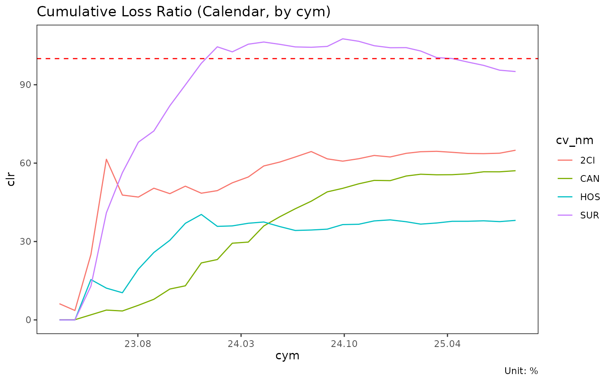

# 집계 프레임워크: triangle, calendar, total

> 영어 원본 보기: [Three aggregation
> frameworks](https://seokhoonj.github.io/lossratio/ko/aggregation-frameworks.md)

동일한 long-format experience 데이터는 분석 질문에 따라 세 가지 방식으로
집계할 수 있다. `lossratio` 는 각 프레임워크별로 하나의 빌더를 제공한다.
이 vignette 은 셋을 비교한다.

## 한눈에 보기

| 빌더 | 출력 객체 | 차원 | 사용 시점 |
|----|----|----|----|
| [`build_triangle()`](https://seokhoonj.github.io/lossratio/ko/reference/build_triangle.md) | `triangle` | 코호트 × dev (2D) | Chain ladder, ED, SA 추정 |
| [`build_calendar()`](https://seokhoonj.github.io/lossratio/ko/reference/build_calendar.md) | `calendar` | 달력 기간 (1D) | 달력 연도 추세, 대각선 효과 |
| [`build_total()`](https://seokhoonj.github.io/lossratio/ko/reference/build_total.md) | `total` | 포트폴리오 합계 (그룹별) | 상위 수준 손해율 비교 |

개념적으로 다음과 같다.

- `triangle` 은 코호트 축 (계약 인수 시점) 과 경과 축 (경과 기간에 따라
  손해가 누적되는 양상) 을 모두 보존한다. Chain ladder 의 표준 데이터
  구조이다.
- `calendar` 는 코호트를 대각선 위로 합산한다 — 각 행은 모든 인수
  코호트에 걸친 하나의 달력 기간이다. Triangle 의 대각선 합과 동치이다.
- `total` 은 두 차원을 모두 합쳐 그룹당 하나의 값으로 축약한다.
  포트폴리오 수준 비교에 유용하다 (어떤 상품이 해당 윈도우에서 가장 나쁜
  손해율을 보였는가?).

## Triangle (코호트 × dev)

``` r

library(lossratio)
data(experience)
exp <- as_experience(experience)

tri <- build_triangle(exp, group_var = cv_nm)
head(tri)
#>     cv_nm n_obs     cohort   dev       loss       rp      closs      crp
#>    <char> <int>     <Date> <int>      <num>    <num>      <num>    <num>
#> 1:    SUR    30 2023-04-01     1      0.000 11191625      0.000 11191625
#> 2:    CAN    30 2023-04-01     1   6445.022 12879189   6445.022 12879189
#> 3:    2CI    30 2023-04-01     1 468845.299  7567722 468845.299  7567722
#> 4:    HOS    30 2023-04-01     1      0.000 15273270      0.000 15273270
#> 5:    SUR    29 2023-04-01     2      0.000 14025887      0.000 25217512
#> 6:    CAN    29 2023-04-01     2      0.000 30821343   6445.022 43700532
#>      margin  cmargin profit cprofit           lr          clr  loss_prop
#>       <num>    <num> <fctr>  <fctr>        <num>        <num>      <num>
#> 1: 11191625 11191625    pos     pos 0.0000000000 0.0000000000 0.00000000
#> 2: 12872744 12872744    pos     pos 0.0005004214 0.0005004214 0.01356018
#> 3:  7098876  7098876    pos     pos 0.0619532953 0.0619532953 0.98643982
#> 4: 15273270 15273270    pos     pos 0.0000000000 0.0000000000 0.00000000
#> 5: 14025887 25217512    pos     pos 0.0000000000 0.0000000000 0.00000000
#> 6: 30821343 43694087    pos     pos 0.0000000000 0.0001474816 0.00000000
#>      rp_prop  closs_prop  crp_prop
#>        <num>       <num>     <num>
#> 1: 0.2385673 0.000000000 0.2385673
#> 2: 0.2745405 0.013560180 0.2745405
#> 3: 0.1613181 0.986439820 0.1613181
#> 4: 0.3255741 0.000000000 0.3255741
#> 5: 0.1890296 0.000000000 0.2082178
#> 6: 0.4153853 0.008953224 0.3608298
```

각 행은 (코호트, dev) 셀 하나이며 누적 손해 / 누적 위험보험료 값을
갖는다. 라인 플롯이나 히트맵으로 시각화할 수 있다.

``` r

plot(tri)              # 코호트별 궤적, 그룹별 facet
```


``` r

plot_triangle(tri)     # 코호트 × dev clr 히트맵
```


`triangle` 은 다음 함수의 입력으로 사용된다.

- [`build_ata()`](https://seokhoonj.github.io/lossratio/ko/reference/build_ata.md),
  [`build_ed()`](https://seokhoonj.github.io/lossratio/ko/reference/build_ed.md)
  — 발달 인자
- [`fit_cl()`](https://seokhoonj.github.io/lossratio/ko/reference/fit_cl.md),
  [`fit_lr()`](https://seokhoonj.github.io/lossratio/ko/reference/fit_lr.md)
  — 추정
- [`detect_cohort_regime()`](https://seokhoonj.github.io/lossratio/ko/reference/detect_cohort_regime.md)
  — 구조 변화 탐지

## Calendar (달력 기간만)

``` r

cal <- build_calendar(exp, group_var = cv_nm, calendar_var = "cym")
head(cal)
#>     cv_nm   calendar   dev       loss        rp       closs       crp   margin
#>    <char>     <Date> <int>      <num>     <num>       <num>     <num>    <num>
#> 1:    2CI 2023-04-01     1   468845.3   7567722    468845.3   7567722  7098876
#> 2:    2CI 2023-05-01     2   788083.2  27286691   1256928.5  34854413 26498608
#> 3:    2CI 2023-06-01     3 18122448.5  42665531  19379377.0  77519944 24543083
#> 4:    2CI 2023-07-01     4 70259226.3  68265635  89638603.2 145785580 -1993591
#> 5:    2CI 2023-08-01     5 32739938.3 110351069 122378541.5 256136649 77611131
#> 6:    2CI 2023-09-01     6 61587155.5 135154730 183965697.0 391291379 73567574
#>      cmargin profit cprofit        lr        clr loss_prop   rp_prop closs_prop
#>        <num> <fctr>  <fctr>     <num>      <num>     <num>     <num>      <num>
#> 1:   7098876    pos     pos 0.0619533 0.06195330 0.9864398 0.1613181  0.9864398
#> 2:  33597485    pos     pos 0.0288816 0.03606225 0.9626042 0.2248381  0.9713592
#> 3:  58140567    pos     pos 0.4247562 0.24999214 0.3480569 0.1688936  0.3631716
#> 4:  56146977    neg     pos 1.0292034 0.61486605 0.4423512 0.2060648  0.4224394
#> 5: 133758108    pos     pos 0.2966889 0.47778614 0.2173681 0.2219566  0.3373051
#> 6: 207325682    pos     pos 0.4556789 0.47015014 0.2061898 0.2113124  0.2781021
#>     crp_prop
#>        <num>
#> 1: 0.1613181
#> 2: 0.2071298
#> 3: 0.1841805
#> 4: 0.1938191
#> 5: 0.2050163
#> 6: 0.2071482
```

각 행은 그룹별 달력 기간 하나이다. 여기서 `dev` 컬럼은 그룹 내부의 순차
인덱스 (1, 2, 3, …) 이며, “코호트 시작 이후의 경과 기간(development
period)” 이 아니다.

Calendar 집계는 수학적으로 triangle 의 **대각선 합** 이다. 같은 `cym`
값을 갖는 셀 (`uym`/`elap_m` 와 무관하게) 이 합쳐진다.

활용 사례는 다음과 같다.

- 추세 분석 (“손해율이 달력 시간에 따라 상승 중”)
- 대각선 효과 (calendar-year effect) 탐지 (예: 규제 충격, 보험료
  on-leveling 이벤트)
- 포트폴리오 모니터링 대시보드

``` r

plot(cal)                       # x = calendar
```



``` r

plot(cal, x_by = "dev")         # x = 순차 인덱스
```


## Total (포트폴리오 요약)

``` r

tot <- build_total(
  exp,
  group_var = cv_nm,
  cohort_var = "uym",
  period_from = "2023-04-01",
  period_to   = "2024-03-01"
)
head(tot)
#>     cv_nm n_obs sales_start  sales_end        loss          rp        lr
#>    <char> <int>      <Date>     <Date>       <num>       <num>     <num>
#> 1:    SUR    30  2023-04-01 2024-03-01 26195800275 23817090349 1.0998741
#> 2:    CAN    30  2023-04-01 2024-03-01 15036650641 24008537115 0.6263043
#> 3:    2CI    30  2023-04-01 2024-03-01 12482828943 18720199622 0.6668107
#> 4:    HOS    30  2023-04-01 2024-03-01  9737095655 25111393761 0.3877561
#>    loss_prop   rp_prop
#>        <num>     <num>
#> 1: 0.4128419 0.2598496
#> 2: 0.2369754 0.2619383
#> 3: 0.1967275 0.2042414
#> 4: 0.1534552 0.2739707
```

그룹당 한 행이며 해당 윈도우의 손해 / 위험보험료 / 손해율을 요약한다.
`period_from` / `period_to` 인자로 고정 윈도우를 지정해 그룹 간 비교
가능성을 확보한다.

활용 사례는 다음과 같다.

- 담보별 전체 손해율 비교
- 그룹별 준비금 / 포트폴리오 비중 순위
- 임원 보고용 요약표 작성

## 데이터 흐름으로 본 집계

                         experience (long, with demographics)
                                  │
             ┌────────────────────┼─────────────────────┐
             │                    │                     │
       build_triangle      build_calendar         build_total
       (cohort × dev)      (calendar series)     (portfolio total)
             │                    │                     │
             ▼                    ▼                     ▼
         triangle             calendar               total
       (2D, projection)     (1D, trend)         (0D, comparison)

세 빌더 모두 동일한 `experience` 에서 출발해 인구통계 차원을 제거한다.
분석 질문에 맞춰 프레임워크를 선택한다.

## 속성 스키마

집계 후 각 객체는 원본 컬럼 메타데이터를 속성으로 저장한다 (플롯 라벨과
단위(granularity) 인지 날짜 형식 지정에 사용된다).

``` r

attr(tri, "cohort_var")      # "uym"
#> [1] "uym"
attr(tri, "cohort_type")     # "month"
#> [1] "month"
attr(tri, "dev_var")         # "elap_m"
#> [1] "elap_m"
attr(tri, "dev_type")        # "month"
#> [1] NA

attr(cal, "calendar_var")    # "cym"
#> [1] "cym"
attr(cal, "calendar_type")   # "month"
#> [1] "month"
```

데이터 컬럼 자체는 `cohort` / `dev` / `calendar` 로 표준화되어 있으므로,
하위 코드는 단위 비의존적으로 동작한다.
