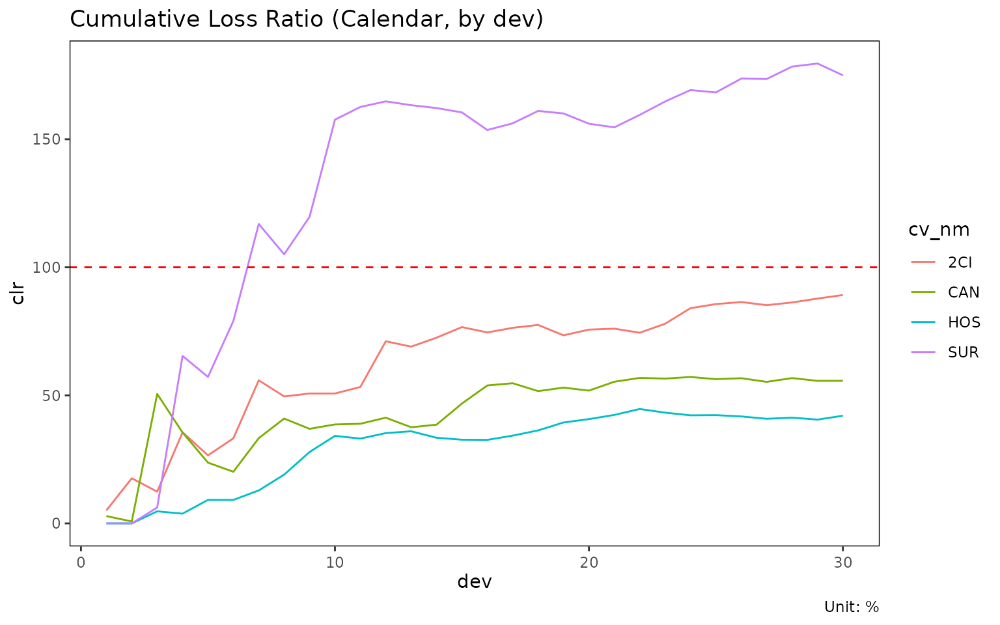

# Aggregation frameworks: triangle, calendar, total

The same long-format experience data can be aggregated three ways
depending on the question being asked. `lossratio` exposes one builder
per framework. This vignette compares them.

## At a glance

| Builder | Output object | Dimension | When to use |
|----|----|----|----|
| [`build_triangle()`](https://seokhoonj.github.io/lossratio/ko/reference/build_triangle.md) | `triangle` | cohort × dev (2D) | Chain ladder, ED, SA projection |
| [`build_calendar()`](https://seokhoonj.github.io/lossratio/ko/reference/build_calendar.md) | `calendar` | calendar period (1D) | Calendar-year trend, diagonal effect |
| [`build_total()`](https://seokhoonj.github.io/lossratio/ko/reference/build_total.md) | `total` | portfolio total (per group) | High-level loss-ratio comparison |

Conceptually:

- `triangle` preserves both the cohort axis (when policies were
  underwritten) and the development axis (how loss accrues over
  development time). This is the canonical chain-ladder data structure.
- `calendar` collapses cohorts onto the diagonal — each row is one
  calendar period across all underwriting cohorts. Equivalent to the
  diagonal sum of the triangle.
- `total` collapses both dimensions to one value per group. Useful for
  portfolio-level comparison (which product had the worst loss ratio
  over the window?).

## Triangle (cohort × dev)

``` r

library(lossratio)
data(experience)
exp <- as_experience(experience)

tri <- build_triangle(exp, group_var = cv_nm)
head(tri)
#>     cv_nm n_obs     cohort   dev     loss       rp    closs      crp   margin
#>    <char> <int>     <Date> <int>    <num>    <num>    <num>    <num>    <num>
#> 1:    SUR    30 2023-04-01     1      0.0 11191625      0.0 11191625 11191625
#> 2:    CAN    30 2023-04-01     1 368972.2 12879189 368972.2 12879189 12510217
#> 3:    2CI    30 2023-04-01     1 384652.4  7567722 384652.4  7567722  7183069
#> 4:    HOS    30 2023-04-01     1      0.0 15273270      0.0 15273270 15273270
#> 5:    SUR    29 2023-04-01     2      0.0 14025887      0.0 25217512 14025887
#> 6:    CAN    29 2023-04-01     2      0.0 30821343 368972.2 43700532 30821343
#>     cmargin profit cprofit         lr         clr loss_prop   rp_prop
#>       <num> <fctr>  <fctr>      <num>       <num>     <num>     <num>
#> 1: 11191625    pos     pos 0.00000000 0.000000000 0.0000000 0.2385673
#> 2: 12510217    pos     pos 0.02864872 0.028648717 0.4895968 0.2745405
#> 3:  7183069    pos     pos 0.05082803 0.050828031 0.5104032 0.1613181
#> 4: 15273270    pos     pos 0.00000000 0.000000000 0.0000000 0.3255741
#> 5: 25217512    pos     pos 0.00000000 0.000000000 0.0000000 0.1890296
#> 6: 43331560    pos     pos 0.00000000 0.008443198 0.0000000 0.4153853
#>    closs_prop  crp_prop
#>         <num>     <num>
#> 1:  0.0000000 0.2385673
#> 2:  0.4895968 0.2745405
#> 3:  0.5104032 0.1613181
#> 4:  0.0000000 0.3255741
#> 5:  0.0000000 0.2082178
#> 6:  0.4654308 0.3608298
```

Each row is one (cohort, dev) cell with cumulative loss / risk premium.
Visualise as line plot or heatmap:

``` r

plot(tri)              # one trajectory per cohort, faceted by group
```


``` r

plot_triangle(tri)     # cohort × dev heatmap of clr
```


Use `triangle` as input to: -
[`build_ata()`](https://seokhoonj.github.io/lossratio/ko/reference/build_ata.md),
[`build_ed()`](https://seokhoonj.github.io/lossratio/ko/reference/build_ed.md)
— development factors -
[`fit_cl()`](https://seokhoonj.github.io/lossratio/ko/reference/fit_cl.md),
[`fit_lr()`](https://seokhoonj.github.io/lossratio/ko/reference/fit_lr.md)
— projection -
[`detect_cohort_regime()`](https://seokhoonj.github.io/lossratio/ko/reference/detect_cohort_regime.md)
— structural change detection

## Calendar (calendar period only)

``` r

cal <- build_calendar(exp, group_var = cv_nm, calendar_var = "cym")
head(cal)
#>     cv_nm   calendar   dev       loss        rp       closs       crp   margin
#>    <char>     <Date> <int>      <num>     <num>       <num>     <num>    <num>
#> 1:    2CI 2023-04-01     1   384652.4   7567722    384652.4   7567722  7183069
#> 2:    2CI 2023-05-01     2  5758812.3  27286691   6143464.7  34854413 21527879
#> 3:    2CI 2023-06-01     3  3470593.2  42665531   9614057.9  77519944 39194938
#> 4:    2CI 2023-07-01     4 42238012.7  68265635  51852070.6 145785580 26027623
#> 5:    2CI 2023-08-01     5 16233022.1 110351069  68085092.7 256136649 94118047
#> 6:    2CI 2023-09-01     6 61916179.4 135154730 130001272.1 391291379 73238550
#>      cmargin profit cprofit         lr        clr  loss_prop   rp_prop
#>        <num> <fctr>  <fctr>      <num>      <num>      <num>     <num>
#> 1:   7183069    pos     pos 0.05082803 0.05082803 0.51040316 0.1613181
#> 2:  28710948    pos     pos 0.21104839 0.17626074 0.99829282 0.2248381
#> 3:  67905887    pos     pos 0.08134419 0.12402044 0.04523554 0.1688936
#> 4:  93933509    pos     pos 0.61873024 0.35567352 0.22192582 0.2060648
#> 5: 188051557    pos     pos 0.14710344 0.26581550 0.16270303 0.2219566
#> 6: 261290107    pos     pos 0.45811330 0.33223648 0.19591344 0.2113124
#>    closs_prop  crp_prop
#>         <num>     <num>
#> 1:  0.5104032 0.1613181
#> 2:  0.9419191 0.2071298
#> 3:  0.1154911 0.1841805
#> 4:  0.1895387 0.1938191
#> 5:  0.1823672 0.2050163
#> 6:  0.1885773 0.2071482
```

Each row is one calendar period (per group). The `dev` column here is a
sequential index (1, 2, 3, …) within group, not “development period
since cohort start”.

Calendar aggregation is mathematically the **diagonal sum** of the
triangle: cells with the same `cym` (regardless of `uym`/`elap_m`) are
combined.

Use cases: - Trend analysis (“loss ratio is rising over calendar
time”) - Calendar-year effect detection (e.g., regulatory shock, premium
on-leveling event) - Portfolio monitoring dashboards

``` r

plot(cal)                           # x = calendar
```


``` r

plot(cal, x_by = "dev")         # x = sequential index
```



## Total (portfolio summary)

``` r

tot <- build_total(
  exp,
  group_var = cv_nm,
  cohort_var = "uym",
  period_from = "2023-04-01",
  period_to   = "2024-03-01"
)
head(tot)
#>     cv_nm n_obs sales_start  sales_end        loss          rp        lr
#>    <char> <int>      <Date>     <Date>       <num>       <num>     <num>
#> 1:    SUR    30  2023-04-01 2024-03-01 43837071345 23817090349 1.8405721
#> 2:    CAN    30  2023-04-01 2024-03-01 14274936766 24008537115 0.5945775
#> 3:    2CI    30  2023-04-01 2024-03-01 17114890156 18720199622 0.9142472
#> 4:    HOS    30  2023-04-01 2024-03-01 11000687149 25111393761 0.4380755
#>    loss_prop   rp_prop
#>        <num>     <num>
#> 1: 0.5083880 0.2598496
#> 2: 0.1655495 0.2619383
#> 3: 0.1984851 0.2042414
#> 4: 0.1275774 0.2739707
```

One row per group, summarising loss / risk premium / loss ratio over the
window. The `period_from` / `period_to` arguments restrict to a fixed
window so groups are comparable.

Use cases: - Compare overall loss ratio across coverages - Rank groups
by reserve / share of portfolio - Build executive summary tables

## Aggregation as data flow

                         experience (long, with demographics)
                                  │
             ┌────────────────────┼─────────────────────┐
             │                    │                     │
       build_triangle      build_calendar         build_total
       (cohort × dev)      (calendar series)     (portfolio total)
             │                    │                     │
             ▼                    ▼                     ▼
         triangle             calendar               total
       (2D, projection)     (1D, trend)         (0D, comparison)

All three start from the same `experience` and aggregate demographic
dimensions away. Choose the framework based on the analytical question.

## Attribute schema

After aggregation, each object stores its source-column metadata as
attributes (used for plot labels and granularity-aware date formatting):

``` r

attr(tri, "cohort_var")      # "uym"
#> [1] "uym"
attr(tri, "cohort_type")     # "month"
#> [1] "month"
attr(tri, "dev_var")     # "elap_m"
#> [1] "elap_m"
attr(tri, "dev_type")    # "month"
#> [1] NA

attr(cal, "calendar_var")    # "cym"
#> [1] "cym"
attr(cal, "calendar_type")   # "month"
#> [1] "month"
```

The data columns themselves are standardised to `cohort` / `dev` /
`calendar`, so downstream code is granularity-agnostic.
