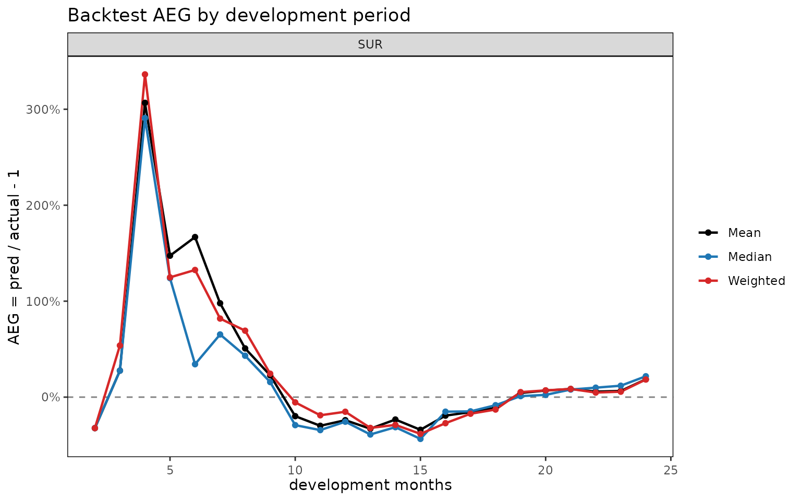
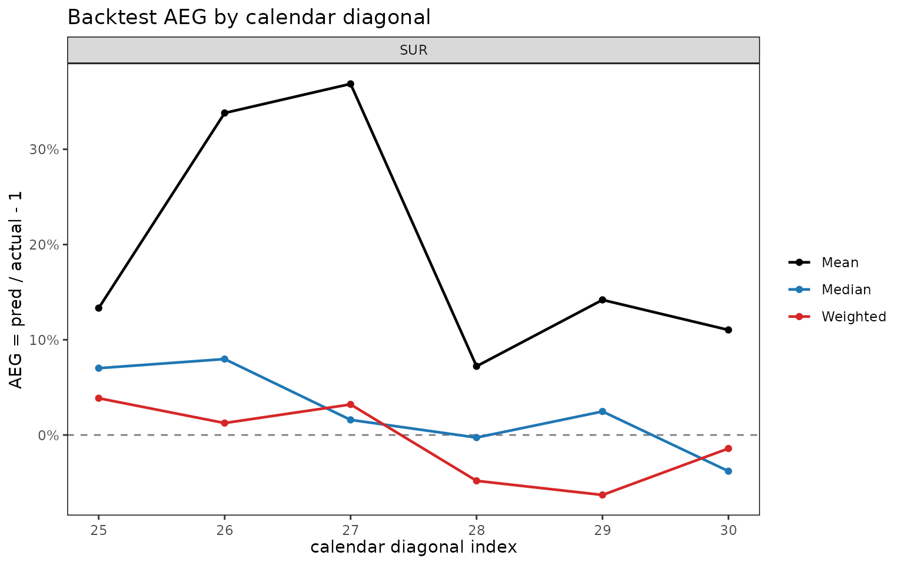

# Backtesting projections against held-out diagonals

## Motivation

Reserving and projection methods are fitted on observed data, but their
practical value lies in how they would have performed at past valuation
dates.
[`backtest()`](https://seokhoonj.github.io/lossratio/ko/reference/backtest.md)
answers that question by hiding the latest `holdout` calendar diagonals
from a triangle, refitting the model on the earlier portion, and
comparing its projection to the actuals that were withheld. This is
calendar-diagonal hold-out (rather than dev-period hold-out), because it
simulates “what would the model have said *K* months ago at the
valuation date?”. The cell-level metric is the Actual-Expected Gap,
$`\mathrm{aeg} = v_{\mathrm{pred}} / v_{\mathrm{actual}} - 1`$, where
positive values flag over-projection and negative values flag
under-projection.

## Basic usage

``` r

library(lossratio)
data(experience)
exp     <- as_experience(experience)
tri_sur <- build_triangle(exp[cv_nm == "SUR"], cv_nm)

bt <- backtest(tri_sur, holdout = 6L, value_var = "closs", method = "mack")
print(bt)
#> <backtest>
#>   fit_fn      : fit_cl
#>   value_var   : closs
#>   holdout     : 6 calendar diagonals
#>   held-out    : 123 cells
#>   AEG         : mean 19.81% / median 2.47%
```

The returned object is a `"backtest"` list with these key slots:

- `aeg` — per-cell `data.table` (cohort, dev, actual, pred, aeg,
  calendar_idx).
- `col_summary` — AEG aggregated by `dev`.
- `diag_summary` — AEG aggregated by calendar diagonal.
- `masked` — the triangle the fit was trained on (latest diagonals
  removed).
- `fit` — the fit object returned by `fit_fn` (a `cl_fit` or `lr_fit`).

`summary(bt)` prints the two summary tables alongside the call metadata.

## Calendar-diagonal masking limitation

Removing the latest `holdout` diagonals shortens the lower-right edge of
the triangle. A chain ladder fit on the masked triangle can only project
as far as its longest cohort × dev support; cells beyond that support,
which would belong to the very oldest cohorts at the largest development
periods, simply have no projection to compare against. The function
silently filters those unreachable cells, so `bt$aeg` always contains
only cells where both an actual and a finite projection exist. The
practical takeaway: `holdout` larger than a few diagonals reduces the
validation set fastest in the oldest cohorts, where the chain ladder
would otherwise rely on its own extrapolated tail.

## Output interpretation

**`col_summary` — systematic bias by development period.** A
consistently signed AEG at a given dev signals a structural mismatch
between the model and that maturity. Early-dev positive values usually
reflect inflated link factors; late-dev values flag tail miscalibration.

``` r

head(bt$col_summary, 8)
#>     cv_nm   dev     n   aeg_mean    aeg_med     aeg_wt
#>    <char> <int> <int>      <num>      <num>      <num>
#> 1:    SUR     2     1 -0.3228967 -0.3228967 -0.3228967
#> 2:    SUR     3     2  0.2760710  0.2760710  0.5380116
#> 3:    SUR     4     3  3.0666760  2.9082082  3.3631170
#> 4:    SUR     5     4  1.4738566  1.2395963  1.2478607
#> 5:    SUR     6     5  1.6680813  0.3429063  1.3252178
#> 6:    SUR     7     6  0.9780860  0.6530255  0.8186990
#> 7:    SUR     8     6  0.5077618  0.4315486  0.6924133
#> 8:    SUR     9     6  0.2276918  0.1570609  0.2440447
```

`aeg_mean` averages cell-level AEG, `aeg_med` is the median, and
`aeg_wt = sum(pred - actual) / sum(actual)` is exposure-weighted.
Comparing the three columns flags whether a few large cells dominate
(`aeg_wt` very different from `aeg_med`) or the bias is uniform.

**`diag_summary` — calendar-year effect.** A single bad diagonal in
otherwise unbiased output points at a calendar event (a rate change,
claim handling shift, or one-off shock) that a static chain ladder
cannot see by construction.

``` r

bt$diag_summary
#>     cv_nm calendar_idx     n   aeg_mean      aeg_med      aeg_wt
#>    <char>        <int> <int>      <num>        <num>       <num>
#> 1:    SUR           25    23 0.13326079  0.070162079  0.03862954
#> 2:    SUR           26    22 0.33811631  0.079737970  0.01255411
#> 3:    SUR           27    21 0.36867941  0.015893924  0.03207125
#> 4:    SUR           28    20 0.07217789 -0.002690612 -0.04810613
#> 5:    SUR           29    19 0.14188721  0.024717168 -0.06295772
#> 6:    SUR           30    18 0.11032715 -0.037993393 -0.01415728
```

A monotone drift across calendar diagonals (as in the SUR example above,
where AEG becomes increasingly negative across `25, ..., 30`) typically
indicates that the latest period is running better than the
earlier-cohort link factors imply.

**`aeg` — cell-level outliers.** For diagnosing specific cohort × dev
cells, inspect `bt$aeg` directly:

``` r

head(bt$aeg, 5)
#>     cv_nm     cohort   dev value_actual value_pred        aeg calendar_idx
#>    <char>     <Date> <int>        <num>      <num>      <num>        <int>
#> 1:    SUR 2023-05-01    24   3069749801 3857304372 0.25655334           25
#> 2:    SUR 2023-06-01    23   3335147200 3569148061 0.07016208           25
#> 3:    SUR 2023-06-01    24   3825555480 4507834001 0.17834757           26
#> 4:    SUR 2023-07-01    22   3899617297 4250600192 0.09000445           25
#> 5:    SUR 2023-07-01    23   4309830408 5032710628 0.16772823           26
```

## Plot demos

Four plot views are registered on `"backtest"`:

``` r

plot(bt, type = "col")    # AEG by dev (point + dashed zero line)
```



``` r

plot(bt, type = "diag")   # AEG by calendar diagonal
```



``` r

plot(bt, type = "cell")   # per-cohort AEG trajectories over dev
```


``` r

plot_triangle(bt)         # diverging-color heatmap on the held-out wedge
```


`type = "col"` is the right place to look for systematic dev-period
bias; `type = "diag"` reveals calendar-year drift; `type = "cell"`
exposes which cohorts contribute the bias;
[`plot_triangle()`](https://seokhoonj.github.io/lossratio/ko/reference/plot_triangle.md)
puts the cell-level AEG values on the same triangular layout as
[`plot_triangle()`](https://seokhoonj.github.io/lossratio/ko/reference/plot_triangle.md)
for the underlying fit, with a red/blue diverging palette where red
marks over-projection.

## Holdout selection

Choose `holdout` to balance two opposing effects:

- Too large: the masked triangle loses its latest experience, so the
  oldest cohorts have few or no reachable cells in their later dev
  periods. The validation set shrinks unevenly, biased toward early dev.
- Too small: the held-out wedge is just a thin diagonal band, which may
  not capture enough cells to reveal systematic patterns.

Typical choices are `holdout = 6L` (half-year) for monthly triangles, or
`holdout = 12L` (full year) for stronger validation when the triangle
has at least 24–30 diagonals of history.

## Choosing the fit function

[`backtest()`](https://seokhoonj.github.io/lossratio/ko/reference/backtest.md)
supports both `fit_cl` and `fit_lr`. The fitter is passed through
`fit_fn`, and `value_var` selects which projection column on `fit$full`
to compare against the held-out actuals. For `fit_cl`, `value_var` is
also forwarded to the fit itself. For `fit_lr` — which projects loss and
exposure jointly — `value_var` only chooses the comparison column, with
the mapping:

| `value_var` | Compared column on `fit_lr$full` |
|-------------|----------------------------------|
| `"closs"`   | `loss_proj`                      |
| `"crp"`     | `exposure_proj`                  |
| `"clr"`     | `clr_proj`                       |

``` r

bt_cl  <- backtest(tri_sur, holdout = 6L, fit_fn = fit_cl,
                   value_var = "closs", method = "mack")
bt_lr  <- backtest(tri_sur, holdout = 6L, fit_fn = fit_lr,
                   method = "sa", value_var = "closs")
bt_clr <- backtest(tri_sur, holdout = 6L, fit_fn = fit_lr,
                   method = "sa", value_var = "clr")

print(bt_clr)
#> <backtest>
#>   fit_fn      : fit_lr
#>   value_var   : clr
#>   holdout     : 6 calendar diagonals
#>   held-out    : 123 cells
#>   AEG         : mean 149.45% / median 7.66%
```

Backtesting `clr` is often the more informative diagnostic: the loss
ratio is unitless and dimension-free across cohorts of very different
volume, so `aeg_mean` and `aeg_med` carry a consistent meaning across
the triangle. Backtesting `closs` weights the result toward whichever
cohorts happen to be the largest at the held-out diagonals.

## See also

- [`vignette("chain-ladder")`](https://seokhoonj.github.io/lossratio/ko/articles/chain-ladder.md)
  —
  [`fit_cl()`](https://seokhoonj.github.io/lossratio/ko/reference/fit_cl.md)
  reference.
- [`vignette("loss-ratio-methods")`](https://seokhoonj.github.io/lossratio/ko/articles/loss-ratio-methods.md)
  —
  [`fit_lr()`](https://seokhoonj.github.io/lossratio/ko/reference/fit_lr.md)
  and the `"sa"`, `"ed"`, `"cl"` methods.
- [`?backtest`](https://seokhoonj.github.io/lossratio/ko/reference/backtest.md),
  [`?plot.backtest`](https://seokhoonj.github.io/lossratio/ko/reference/plot.backtest.md),
  [`?plot_triangle.backtest`](https://seokhoonj.github.io/lossratio/ko/reference/plot_triangle.backtest.md).
