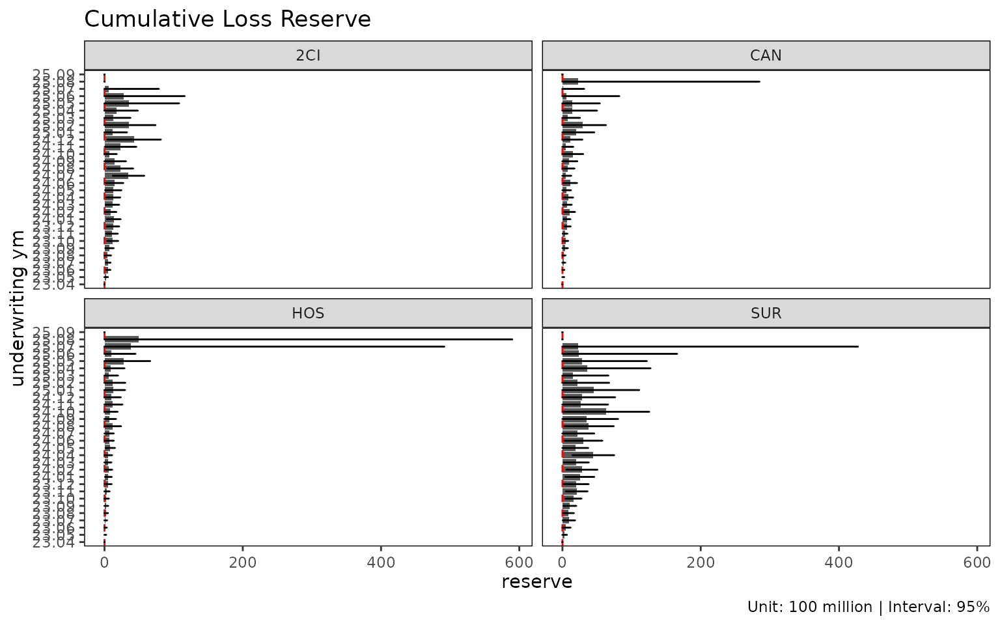
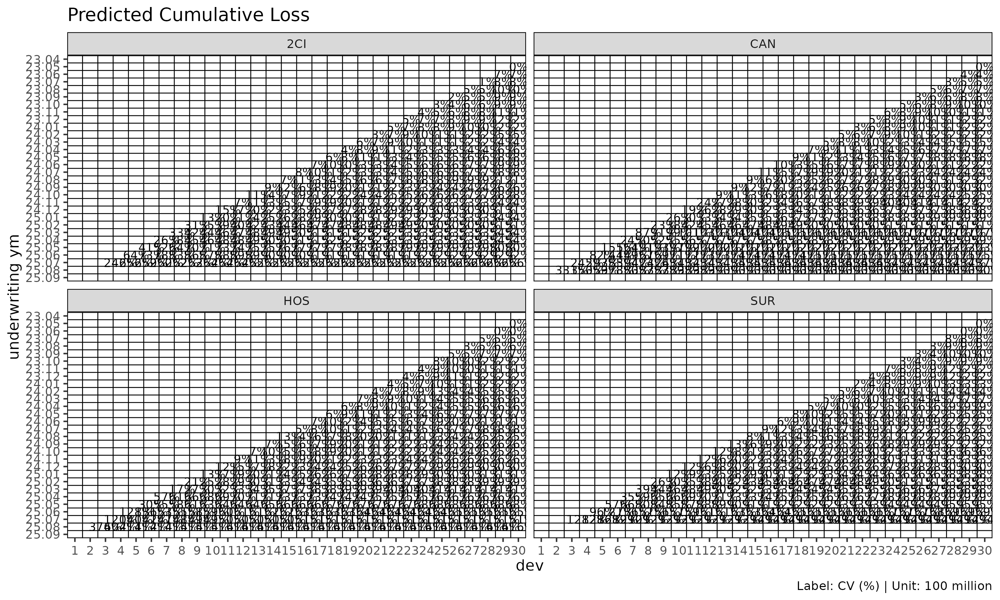
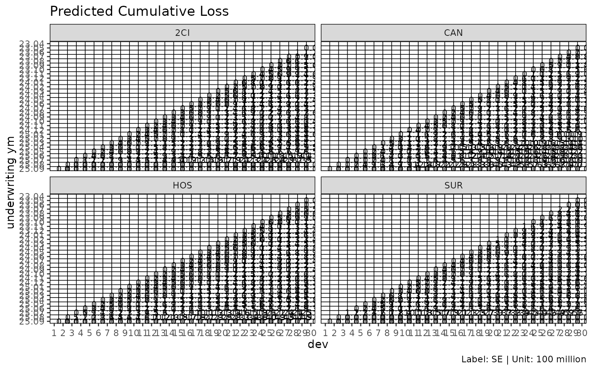

# Chain ladder reserving with fit_cl

[`fit_cl()`](https://seokhoonj.github.io/lossratio/ko/reference/fit_cl.md)
is the dedicated chain ladder fit for a single value column. Unlike
[`fit_lr()`](https://seokhoonj.github.io/lossratio/ko/reference/fit_lr.md)
(which projects loss / exposure jointly to get loss ratio),
[`fit_cl()`](https://seokhoonj.github.io/lossratio/ko/reference/fit_cl.md)
projects one cumulative metric forward and computes Mack-style standard
errors per cohort.

## Basic usage

``` r

library(lossratio)
data(experience)
exp <- as_experience(experience)
tri <- build_triangle(exp, group_var = cv_nm)

cl <- fit_cl(tri, value_var = "closs", method = "mack")
print(cl)
#> <cl_fit>
#> method      : mack 
#> value_var   : closs 
#> weight_var  : none 
#> alpha       : 1 
#> sigma_method: min_last2 
#> recent      : all 
#> use_maturity: FALSE 
#> tail_factor : 1 
#> groups      : cv_nm 
#> periods     : 120
```

`value_var` selects the cumulative column to project — typically
`"closs"` (cumulative loss) for reserving, or `"crp"` (cumulative risk
premium) for exposure projection.

## Method: basic vs Mack

Two estimation methods are available:

| `method`  | What it computes                                    |
|-----------|-----------------------------------------------------|
| `"basic"` | Point projection only (selected age-to-age factors) |
| `"mack"`  | Point projection + factor / process / parameter SE  |

``` r

cl_basic <- fit_cl(tri, value_var = "closs", method = "basic")
cl_mack  <- fit_cl(tri, value_var = "closs", method = "mack")

names(cl_basic)
#>  [1] "call"          "data"          "method"        "group_var"    
#>  [5] "cohort_var"    "dev_var"       "value_var"     "full"         
#>  [9] "pred"          "ata"           "summary"       "factor"       
#> [13] "selected"      "maturity"      "alpha"         "sigma_method" 
#> [17] "weight_var"    "recent"        "use_maturity"  "maturity_args"
#> [21] "tail"          "tail_factor"

# Mack adds variance estimates to $full and $summary
head(cl_mack$summary)
#>     cv_nm     cohort     latest   ultimate   reserve   proc_se  param_se
#>    <char>     <Date>      <num>      <num>     <num>     <num>     <num>
#> 1:    2CI 2023-04-01 1769961365 1769961365         0         0         0
#> 2:    2CI 2023-05-01 2177258013 2408047363 230789349  81021770  94495076
#> 3:    2CI 2023-06-01 2004054588 2522359218 518304630 111885319 114904860
#> 4:    2CI 2023-07-01 1740086803 2284297217 544210414 115767968 107391009
#> 5:    2CI 2023-08-01 1020729631 1487357605 466627974 209491141 103506080
#> 6:    2CI 2023-09-01 1274137934 1994001146 719863212 260688161 144891377
#>           se         cv
#>        <num>      <num>
#> 1:         0 0.00000000
#> 2: 124474280 0.05169096
#> 3: 160379087 0.06358297
#> 4: 157908363 0.06912777
#> 5: 233666529 0.15710178
#> 6: 298247931 0.14957260
```

`method = "mack"` enables the projection plot’s confidence bands
(`show_interval = TRUE`):

``` r

plot(cl_mack, type = "projection", show_interval = TRUE)
```


## Tail factor

For triangles where the latest observed development period is still
developing, an extrapolated tail factor estimates ultimate:

``` r

# Log-linear extrapolation from the selected ata factors
cl_tail <- fit_cl(tri, value_var = "closs", method = "mack", tail = TRUE)

# Or supply a literal tail factor
cl_tail <- fit_cl(tri, value_var = "closs", method = "mack", tail = 1.025)
```

The extrapolation fits $`\log(f_k - 1) \sim k`$ to projected factors and
extends the projection by the cumulative product of extrapolated $`f_k`$
values. Disabled by default (`tail = FALSE`).

## Maturity filtering

If selected ata factors are volatile, restrict projection to the mature
region only:

``` r

cl_mat <- fit_cl(
  tri,
  value_var     = "closs",
  method        = "mack",
  maturity_args = list(cv_threshold = 0.10, rse_threshold = 0.05)
)

cl_mat$maturity
#> Key: <cv_nm>
#>     cv_nm ata_from ata_to ata_link  mean median    wt    cv     f  f_se   rse
#>    <char>    <num>  <num>   <char> <num>  <num> <num> <num> <num> <num> <num>
#> 1:    2CI       18     19    18-19 1.076  1.047 1.076 0.055 1.076 0.017 0.016
#> 2:    CAN       17     18    17-18 1.137  1.119 1.126 0.093 1.126 0.027 0.024
#> 3:    HOS       17     18    17-18 1.107  1.092 1.101 0.054 1.101 0.018 0.016
#> 4:    SUR       15     16    15-16 1.092  1.038 1.098 0.094 1.098 0.027 0.025
#>       sigma n_obs n_valid n_inf n_nan valid_ratio
#>       <num> <num>   <num> <num> <num>       <num>
#> 1: 1650.456    12      12     0     0           1
#> 2: 2473.092    13      13     0     0           1
#> 3: 1350.950    13      13     0     0           1
#> 4: 4057.711    15      15     0     0           1
```

`maturity_args` is forwarded to
[`find_ata_maturity()`](https://seokhoonj.github.io/lossratio/ko/reference/find_ata_maturity.md).

## Variance components (Mack)

`fit_cl(method = "mack")` decomposes the projection variance into:

- `proc_se` — process variance, from $`\sigma^2_k`$ (residual link
  variance per development period).
- `param_se` — parameter variance, from the uncertainty of the selected
  age-to-age factors $`\hat{f}_k`$.
- `se` — total standard error,
  $`\sqrt{\mathrm{proc\_se}^2 + \mathrm{param\_se}^2}`$.
- `cv` — coefficient of variation, `se / value_proj`.

``` r

summary(cl_mack)
#>       cv_nm     cohort     latest   ultimate    reserve     proc_se   param_se
#>      <char>     <Date>      <num>      <num>      <num>       <num>      <num>
#>   1:    2CI 2023-04-01 1769961365 1769961365          0           0          0
#>   2:    2CI 2023-05-01 2177258013 2408047363  230789349    81021770   94495076
#>   3:    2CI 2023-06-01 2004054588 2522359218  518304630   111885319  114904860
#>   4:    2CI 2023-07-01 1740086803 2284297217  544210414   115767968  107391009
#>   5:    2CI 2023-08-01 1020729631 1487357605  466627974   209491141  103506080
#>  ---                                                                          
#> 116:    SUR 2025-05-01   79474575 2873248566 2793773992  4722987523  809706186
#> 117:    SUR 2025-06-01   44351381 2365070816 2320719436  7190998494 1055891775
#> 118:    SUR 2025-07-01   12461511 2312527756 2300066245 20431127319 2852680795
#> 119:    SUR 2025-08-01          0          0          0           0          0
#> 120:    SUR 2025-09-01          0          0          0           0          0
#>               se         cv
#>            <num>      <num>
#>   1:           0 0.00000000
#>   2:   124474280 0.05169096
#>   3:   160379087 0.06358297
#>   4:   157908363 0.06912777
#>   5:   233666529 0.15710178
#>  ---                       
#> 116:  4791892659 1.66776126
#> 117:  7268106134 3.07310296
#> 118: 20629317760 8.92067899
#> 119:           0         NA
#> 120:           0         NA
```

## Reserve plot

`type = "reserve"` shows reserve per cohort with optional error bars
(Mack only):

``` r

plot(cl_mack, type = "reserve", conf_level = 0.95)
```



## Triangle visualisation

[`plot_triangle()`](https://seokhoonj.github.io/lossratio/ko/reference/plot_triangle.md)
displays the cohort × dev cells as a heatmap, distinguishing observed
cells from projected:

``` r

plot_triangle(cl_mack, what = "full")    # observed + projected
```


``` r

plot_triangle(cl_mack, what = "pred")    # projected only
```


``` r

plot_triangle(cl_mack, what = "data")    # observed only
```


The `label_style = "cv"` mode shows coefficient of variation per cell,
useful for spotting unreliable cells:

``` r

plot_triangle(cl_mack, label_style = "cv")
```



``` r

plot_triangle(cl_mack, label_style = "se")
```



``` r

plot_triangle(cl_mack, label_style = "ci")
```


## Sigma extrapolation methods

Mack variance requires $`\sigma_k`$ at all development links, including
the last where it cannot be estimated directly. `sigma_method` controls
the extrapolation:

| `sigma_method` | Behaviour |
|----|----|
| `"min_last2"` | (default) min of the last two estimable $`\sigma`$ values — conservative |
| `"locf"` | Last observation carried forward |
| `"loglinear"` | Log-linear extrapolation from the observed $`\sigma_k`$ sequence |

``` r

fit_cl(tri, value_var = "closs", method = "mack", sigma_method = "loglinear")
#> <cl_fit>
#> method      : mack 
#> value_var   : closs 
#> weight_var  : none 
#> alpha       : 1 
#> sigma_method: loglinear 
#> recent      : all 
#> use_maturity: FALSE 
#> tail_factor : 1 
#> groups      : cv_nm 
#> periods     : 120
```

## See also

- [`vignette("loss-ratio-methods")`](https://seokhoonj.github.io/lossratio/ko/articles/loss-ratio-methods.md)
  — when to use
  [`fit_lr()`](https://seokhoonj.github.io/lossratio/ko/reference/fit_lr.md)
  instead.
- [`vignette("triangle-diagnostics")`](https://seokhoonj.github.io/lossratio/ko/articles/triangle-diagnostics.md)
  —
  [`summary_ata()`](https://seokhoonj.github.io/lossratio/ko/reference/summary_ata.md),
  [`find_ata_maturity()`](https://seokhoonj.github.io/lossratio/ko/reference/find_ata_maturity.md),
  ata diagnostic plots.
- [`?fit_cl`](https://seokhoonj.github.io/lossratio/ko/reference/fit_cl.md),
  [`?find_ata_maturity`](https://seokhoonj.github.io/lossratio/ko/reference/find_ata_maturity.md),
  [`?fit_ata`](https://seokhoonj.github.io/lossratio/ko/reference/fit_ata.md).
