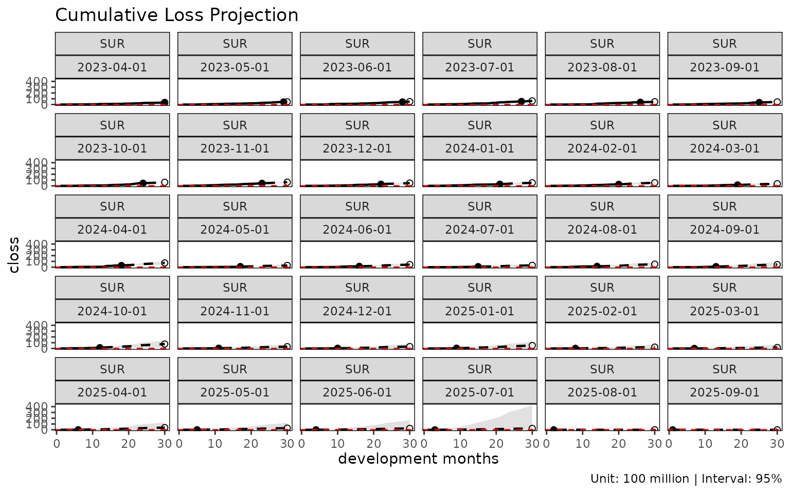

# Getting started with lossratio

This vignette walks the full `lossratio` pipeline on the bundled
synthetic experience data, from raw long-format rows to a fitted
loss-ratio projection.

## Input shape

`lossratio` consumes long-format experience data — one row per (cohort ×
dev × demographic) cell. The bundled dataset `experience` is a
33,381-row table with calendar / underwriting period columns at multiple
granularities, demographic dimensions (`cv_nm`, `age_band`, `gender`),
and amounts (`loss`, `rp`).

``` r

library(lossratio)

data(experience)
str(experience)
#> Classes 'data.table' and 'data.frame':   33480 obs. of  17 variables:
#>  $ cy      : Date, format: "2023-01-01" "2023-01-01" ...
#>  $ cyh     : Date, format: "2023-01-01" "2023-01-01" ...
#>  $ cyq     : Date, format: "2023-04-01" "2023-04-01" ...
#>  $ cym     : Date, format: "2023-04-01" "2023-04-01" ...
#>  $ uy      : Date, format: "2023-01-01" "2023-01-01" ...
#>  $ uyh     : Date, format: "2023-01-01" "2023-01-01" ...
#>  $ uyq     : Date, format: "2023-04-01" "2023-04-01" ...
#>  $ uym     : Date, format: "2023-04-01" "2023-04-01" ...
#>  $ elap_y  : int  1 1 1 1 1 1 1 1 1 1 ...
#>  $ elap_h  : int  1 1 1 1 1 1 1 1 1 1 ...
#>  $ elap_q  : int  1 1 1 1 1 1 1 1 1 1 ...
#>  $ elap_m  : int  1 1 1 1 1 1 1 1 1 1 ...
#>  $ cv_nm   : chr  "SUR" "SUR" "SUR" "SUR" ...
#>  $ age_band: Ord.factor w/ 9 levels "30-34"<"35-39"<..: 1 1 2 2 3 3 4 4 5 5 ...
#>  $ gender  : Factor w/ 2 levels "M","F": 1 2 1 2 1 2 1 2 1 2 ...
#>  $ loss    : num  0 0 0 0 0 0 0 0 0 0 ...
#>  $ rp      : num  3555865 258448 255420 464313 92744 ...
#>  - attr(*, ".internal.selfref")=<pointer: (nil)>
```

## Step 1 — Validate and coerce

``` r

exp <- as_experience(experience)
class(exp)
#> [1] "experience" "data.table" "data.frame"
```

[`as_experience()`](https://seokhoonj.github.io/lossratio/ko/reference/as_experience.md)
checks required columns (`cym`, `uym`, `loss`, `rp`), coerces date
columns, and tags the class. Use `check_experience(df)` for a
non-mutating check.

## Step 2 — Build the cohort × dev structure

``` r

tri <- build_triangle(exp[cv_nm == "SUR"], group_var = cv_nm)
class(tri)
#> [1] "triangle"   "data.table" "data.frame"
names(tri)
#>  [1] "cv_nm"      "n_obs"      "cohort"     "dev"        "loss"      
#>  [6] "rp"         "closs"      "crp"        "margin"     "cmargin"   
#> [11] "profit"     "cprofit"    "lr"         "clr"        "loss_prop" 
#> [16] "rp_prop"    "closs_prop" "crp_prop"
```

[`build_triangle()`](https://seokhoonj.github.io/lossratio/ko/reference/build_triangle.md):

- aggregates demographic dimensions away (here: `age_band`, `gender`),
- adds cumulative columns (`closs`, `crp`),
- adds derived metrics (`margin`, `lr`, `clr`, proportions),
- standardises the cohort / development columns to the names `cohort`
  and `dev`,
- preserves original column names as attributes (`cohort_var`,
  `dev_var`) for downstream plot labels.

## Step 3 — Diagnostics

``` r

plot(tri)              # cohort trajectories of clr
```


``` r

plot_triangle(tri)     # heatmap of clr cells
```


``` r

summary(tri)           # group-wise statistics by dev
#> Key: <cv_nm, dev>
#>      cv_nm   dev n_obs   lr_mean   lr_median     lr_wt  clr_mean clr_median
#>     <char> <int> <int>     <num>       <num>     <num>     <num>      <num>
#>  1:    SUR     1    30 0.2080530 0.000000000 0.1939673 0.2080530 0.00000000
#>  2:    SUR     2    29 0.2455538 0.005389659 0.2372175 0.2202379 0.07780699
#>  3:    SUR     3    28 0.5412315 0.149100068 0.5524150 0.3571573 0.17176644
#>  4:    SUR     4    27 1.5617397 0.543742527 1.5699270 0.8304897 0.41766876
#>  5:    SUR     5    26 1.3257256 0.554421837 1.2462162 0.9114759 0.56431947
#>  6:    SUR     6    25 1.0841279 0.364401372 1.0639413 0.9546004 0.62534087
#>  7:    SUR     7    24 1.4711422 1.134317987 1.6172051 1.0984422 0.98311641
#>  8:    SUR     8    23 2.2396563 0.996762568 2.4695749 1.3964044 1.08696795
#>  9:    SUR     9    22 1.4031861 0.824852660 1.4343234 1.4472806 1.26573251
#> 10:    SUR    10    21 1.7333809 1.634368507 1.6294610 1.4723949 1.34961049
#> 11:    SUR    11    20 1.9663471 1.458094766 1.9482510 1.5649672 1.42466715
#> 12:    SUR    12    19 1.6445594 1.513862297 1.6854737 1.6041294 1.73852449
#> 13:    SUR    13    18 1.8888322 1.771917063 1.8753259 1.5778061 1.62346695
#> 14:    SUR    14    17 2.7101106 1.600630993 2.9504589 1.7536365 1.80562172
#> 15:    SUR    15    16 1.3972429 1.163043712 1.6278065 1.7482681 1.81444100
#> 16:    SUR    16    15 1.3626847 0.949735140 1.4546782 1.7552695 1.77659237
#> 17:    SUR    17    14 1.9781489 1.314777415 1.9060125 1.7781093 1.72479209
#> 18:    SUR    18    13 1.1693884 0.932454770 1.2171785 1.7707780 1.66392094
#> 19:    SUR    19    12 2.1965368 2.260330218 2.2839805 1.7476903 1.68893025
#> 20:    SUR    20    11 1.5572205 1.469457065 1.4796093 1.7494610 1.68582650
#> 21:    SUR    21    10 2.0892894 1.483108861 2.0235415 1.7519754 1.71238115
#> 22:    SUR    22     9 2.7635619 2.409323706 2.7577694 1.8200468 1.78159642
#> 23:    SUR    23     8 3.1877661 3.053144735 3.4726693 1.9556090 1.86412239
#> 24:    SUR    24     7 1.9738514 2.197825361 2.1989655 1.9258036 1.94859885
#> 25:    SUR    25     6 0.9013157 1.010235567 0.9451548 1.8263456 1.79643323
#> 26:    SUR    26     5 1.6444242 0.846026751 1.6342535 1.8460220 1.86913373
#> 27:    SUR    27     4 1.5504010 1.331600631 1.4532497 1.8208416 1.84639352
#> 28:    SUR    28     3 1.9738903 1.064691530 1.6041476 1.6785125 1.68390907
#> 29:    SUR    29     2 1.0848500 1.084849979 1.1297025 1.6450982 1.64509820
#> 30:    SUR    30     1 1.1455972 1.145597160 1.1455972 1.3380971 1.33809709
#>      cv_nm   dev n_obs   lr_mean   lr_median     lr_wt  clr_mean clr_median
#>     <char> <int> <int>     <num>       <num>     <num>     <num>      <num>
#>        clr_wt
#>         <num>
#>  1: 0.1939673
#>  2: 0.2224665
#>  3: 0.3630603
#>  4: 0.8177716
#>  5: 0.9316804
#>  6: 0.9778684
#>  7: 1.1201157
#>  8: 1.4142730
#>  9: 1.4513118
#> 10: 1.4784032
#> 11: 1.5736234
#> 12: 1.6120511
#> 13: 1.5964003
#> 14: 1.7651456
#> 15: 1.7502698
#> 16: 1.7562775
#> 17: 1.7802338
#> 18: 1.7691786
#> 19: 1.7542191
#> 20: 1.7554551
#> 21: 1.7613209
#> 22: 1.8339909
#> 23: 1.9722480
#> 24: 1.9357069
#> 25: 1.8304242
#> 26: 1.8502970
#> 27: 1.8264828
#> 28: 1.6715582
#> 29: 1.6351190
#> 30: 1.3380971
#>        clr_wt
#>         <num>
```

## Step 4 — Development modeling

Two complementary views of cohort development:

``` r

# Age-to-age factors
ata <- build_ata(tri, value_var = "closs")
fit_ata(ata)
#> <ata_fit>
#> alpha       : 1 
#> sigma_method: min_last2 
#> recent      : all 
#> use_maturity: FALSE 
#> groups      : cv_nm 
#> n_groups    : 1 
#> ata links   : 29

# Exposure-driven intensities
ed <- build_ed(tri, loss_var = "closs", exposure_var = "crp")
fit_ed(ed)
#> <ed_fit>
#> method      : basic 
#> loss_var    : closs 
#> exposure_var: crp 
#> alpha       : 1 
#> sigma_method: min_last2 
#> recent      : all 
#> groups      : cv_nm 
#> n_groups    : 1 
#> links       : 29
```

[`fit_ata()`](https://seokhoonj.github.io/lossratio/ko/reference/fit_ata.md)
returns selected age-to-age factors per development link.
[`fit_ed()`](https://seokhoonj.github.io/lossratio/ko/reference/fit_ed.md)
returns intensity factors $`g_k = \Delta C^L_k / C^P_k`$. Both are
inputs to the projection methods below.

## Step 5 — Projection

[`fit_cl()`](https://seokhoonj.github.io/lossratio/ko/reference/fit_cl.md)
runs a chain ladder projection:

``` r

cl <- fit_cl(tri, value_var = "closs", method = "mack")
plot(cl, type = "projection")
```



``` r

summary(cl)
#>      cv_nm     cohort     latest   ultimate    reserve     proc_se   param_se
#>     <char>     <Date>      <num>      <num>      <num>       <num>      <num>
#>  1:    SUR 2023-04-01 3507505356 3507505356          0           0          0
#>  2:    SUR 2023-05-01 4406252675 4692659098  286406424   115260759  133302193
#>  3:    SUR 2023-06-01 4509339237 4989741692  480402456   260546297  229777362
#>  4:    SUR 2023-07-01 5313443543 6249920460  936476917   323487807  303531340
#>  5:    SUR 2023-08-01 3911972952 4790104551  878131600   302841480  238651514
#>  6:    SUR 2023-09-01 3526798889 4586214482 1059415593   392548272  254462375
#>  7:    SUR 2023-10-01 4570171158 6156953685 1586782527   470323491  346064336
#>  8:    SUR 2023-11-01 4307117714 6353810849 2046693136   682297376  413067407
#>  9:    SUR 2023-12-01 2804040621 4756961997 1952921376   846641173  371481860
#> 10:    SUR 2024-01-01 2802596394 5310789808 2508193413   967471922  433176089
#> 11:    SUR 2024-02-01 2579006390 5390468156 2811461766  1040126141  455118832
#> 12:    SUR 2024-03-01 1598826418 3605760085 2006933667   860004678  306092171
#> 13:    SUR 2024-04-01 2886602142 7343304556 4456702414  1383569396  661959599
#> 14:    SUR 2024-05-01 1069844601 2925726831 1855882230   902243763  267911601
#> 15:    SUR 2024-06-01 1441825655 4443751247 3001925593  1330587755  446291293
#> 16:    SUR 2024-07-01  920185549 3113972263 2193786714  1176679539  322137404
#> 17:    SUR 2024-08-01 1367757350 5179388346 3811630995  1733832466  577622326
#> 18:    SUR 2024-09-01  940227572 4479020413 3538792841  2210584453  610162835
#> 19:    SUR 2024-10-01 1396666726 7711276603 6314609878  2989040405 1072033239
#> 20:    SUR 2024-11-01  469264829 3075404317 2606139487  1979891967  440762324
#> 21:    SUR 2024-12-01  402765219 3257251807 2854486587  2370955488  516172961
#> 22:    SUR 2025-01-01  518265377 5092462598 4574197221  3206591244  851970535
#> 23:    SUR 2025-02-01  193154960 2332563087 2139408127  2308254859  407144209
#> 24:    SUR 2025-03-01   87626232 1619023322 1531397089  2577171382  351339683
#> 25:    SUR 2025-04-01  141379071 3769384328 3628005256  4545247070  919561739
#> 26:    SUR 2025-05-01   79474575 2873248566 2793773992  4722987523  809706186
#> 27:    SUR 2025-06-01   44351381 2365070816 2320719436  7190998494 1055891775
#> 28:    SUR 2025-07-01   12461511 2312527756 2300066245 20431127319 2852680795
#> 29:    SUR 2025-08-01          0          0          0           0          0
#> 30:    SUR 2025-09-01          0          0          0           0          0
#>      cv_nm     cohort     latest   ultimate    reserve     proc_se   param_se
#>     <char>     <Date>      <num>      <num>      <num>       <num>      <num>
#>              se         cv
#>           <num>      <num>
#>  1:           0 0.00000000
#>  2:   176222919 0.03755289
#>  3:   347393162 0.06962147
#>  4:   443593999 0.07097594
#>  5:   385574257 0.08049391
#>  6:   467808985 0.10200329
#>  7:   583921836 0.09483941
#>  8:   797592874 0.12552984
#>  9:   924553972 0.19435807
#> 10:  1060020492 0.19959752
#> 11:  1135339395 0.21061981
#> 12:   912852926 0.25316519
#> 13:  1533771425 0.20886665
#> 14:   941180340 0.32169112
#> 15:  1403438524 0.31582293
#> 16:  1219978379 0.39177561
#> 17:  1827518145 0.35284439
#> 18:  2293247110 0.51199747
#> 19:  3175471273 0.41179579
#> 20:  2028359836 0.65954250
#> 21:  2426492211 0.74495076
#> 22:  3317842853 0.65152032
#> 23:  2343887135 1.00485477
#> 24:  2601009786 1.60653015
#> 25:  4637333794 1.23026293
#> 26:  4791892659 1.66776126
#> 27:  7268106134 3.07310296
#> 28: 20629317760 8.92067899
#> 29:           0         NA
#> 30:           0         NA
#>              se         cv
#>           <num>      <num>
```

[`fit_lr()`](https://seokhoonj.github.io/lossratio/ko/reference/fit_lr.md)
runs a loss-ratio projection. The default `method = "sa"`
(stage-adaptive) uses exposure-driven before maturity and chain ladder
after, switching at the per-group maturity point detected from the ata
factors.

``` r

lr <- fit_lr(tri, method = "sa")
plot(lr, type = "clr")
```


``` r

summary(lr)
#>      cv_nm     cohort     latest   ultimate    reserve exposure_ult clr_latest
#>     <char>     <Date>      <num>      <num>      <num>        <num>      <num>
#>  1:    SUR 2023-04-01 3507505356 3507505356          0   2621263717  1.3380971
#>  2:    SUR 2023-05-01 4406252675 4692659098  286406424   2447179852  1.9373843
#>  3:    SUR 2023-06-01 4509339237 4989741692  480402456   3045660786  1.6839091
#>  4:    SUR 2023-07-01 5313443543 6249920460  936476917   2859002912  2.2532321
#>  5:    SUR 2023-08-01 3911972952 4790104551  878131600   2669412392  1.8691337
#>  6:    SUR 2023-09-01 3526798889 4586214482 1059415593   2893769142  1.6648169
#>  7:    SUR 2023-10-01 4570171158 6156953685 1586782527   3094707500  2.1604887
#>  8:    SUR 2023-11-01 4307117714 6353810849 2046693136   2879458987  2.3699733
#>  9:    SUR 2023-12-01 2804040621 4756961997 1952921376   2843155663  1.6876214
#> 10:    SUR 2024-01-01 2802596394 5310789808 2508193413   2974323113  1.7332940
#> 11:    SUR 2024-02-01 2579006390 5390468156 2811461766   2661467247  1.9393670
#> 12:    SUR 2024-03-01 1598826418 3605760085 2006933667   2483209935  1.4110120
#> 13:    SUR 2024-04-01 2886602142 7343304556 4456702414   2676093355  2.5884670
#> 14:    SUR 2024-05-01 1069844601 2925726831 1855882230   2650182997  1.0781941
#> 15:    SUR 2024-06-01 1441825655 4443751247 3001925593   2653104694  1.6227525
#> 16:    SUR 2024-07-01  920185549 3113972263 2193786714   2758730497  1.1155218
#> 17:    SUR 2024-08-01 1367757350 5184406888 3816649538   2949332103  1.7510206
#> 18:    SUR 2024-09-01  940227572 4529063006 3588835434   2628969704  1.5394236
#> 19:    SUR 2024-10-01 1396666726 6507558014 5110891288   2600171987  2.6195782
#> 20:    SUR 2024-11-01  469264829 3790320997 3321056168   2558267991  1.0529047
#> 21:    SUR 2024-12-01  402765219 4334152656 3931387437   2865484237  0.9528421
#> 22:    SUR 2025-01-01  518265377 5036348322 4518082945   2811568955  1.4882717
#> 23:    SUR 2025-02-01  193154960 4645763088 4452608128   3116396355  0.6170140
#> 24:    SUR 2025-03-01   87626232 4434935578 4347309346   2859035712  0.3804721
#> 25:    SUR 2025-04-01  141379071 4826181874 4684802803   2820900137  0.7901498
#> 26:    SUR 2025-05-01   79474575 5330755348 5251280773   3170694512  0.5208363
#> 27:    SUR 2025-06-01   44351381 4669095782 4624744401   2746665433  0.4418904
#> 28:    SUR 2025-07-01   12461511 6405537028 6393075517   3705335918  0.1463368
#> 29:    SUR 2025-08-01          0 5151619396 5151619396   2969197221  0.0000000
#> 30:    SUR 2025-09-01          0 5216378154 5216378154   2995415278  0.0000000
#>      cv_nm     cohort     latest   ultimate    reserve exposure_ult clr_latest
#>     <char>     <Date>      <num>      <num>      <num>        <num>      <num>
#>      clr_ult maturity_from    proc_se  param_se         se         cv
#>        <num>         <num>      <num>     <num>      <num>      <num>
#>  1: 1.338097            15          0         0          0 0.00000000
#>  2: 1.917578            15  115260759 133302193  176222919 0.03755289
#>  3: 1.638312            15  260546297 229777362  347393162 0.06962147
#>  4: 2.186049            15  323487807 303531340  443593999 0.07097594
#>  5: 1.794442            15  302841480 238651514  385574257 0.08049391
#>  6: 1.584858            15  392548272 254462375  467808985 0.10200329
#>  7: 1.989511            15  470323491 346064336  583921836 0.09483941
#>  8: 2.206599            15  682297376 413067407  797592874 0.12552984
#>  9: 1.673128            15  846641173 371481860  924553972 0.19435807
#> 10: 1.785546            15  967471922 433176089 1060020492 0.19959752
#> 11: 2.025375            15 1040126141 455118832 1135339395 0.21061981
#> 12: 1.452056            15  860004678 306092171  912852926 0.25316519
#> 13: 2.744039            15 1383569396 661959599 1533771425 0.20886665
#> 14: 1.103972            15  902243763 267911601  941180340 0.32169112
#> 15: 1.674925            15 1330587755 446291293 1403438524 0.31582293
#> 16: 1.128770            15 1176679539 322137404 1219978379 0.39177561
#> 17: 1.757824            15 1653413517 562374194 1746436656 0.33686335
#> 18: 1.722752            15 1920875276 560752113 2001050913 0.44182448
#> 19: 2.502741            15 2158786246 742807671 2283007072 0.35082393
#> 20: 1.481597            15 1896073998 507474792 1962811063 0.51784824
#> 21: 1.512538            15 2081774707 587531425 2163094798 0.49908136
#> 22: 1.791295            15 2161224847 643156031 2254893017 0.44772380
#> 23: 1.490748            15 2219680565 643605267 2311105698 0.49746525
#> 24: 1.551200            15 2238134503 619051552 2322169433 0.52360838
#> 25: 1.710866            15 2299686885 650849914 2390013678 0.49521832
#> 26: 1.681258            15 2441571165 725982384 2547218125 0.47783437
#> 27: 1.699914            15 2282292178 633588616 2368605523 0.50729427
#> 28: 1.728733            15 2692258007 868125300 2828762046 0.44161200
#> 29: 1.735021            15 2413061918 697300804 2511791439 0.48757318
#> 30: 1.741454            15 2425838047 705030372 2526214175 0.48428509
#>      clr_ult maturity_from    proc_se  param_se         se         cv
#>        <num>         <num>      <num>     <num>      <num>      <num>
#>         se_clr     cv_clr    ci_lower ci_upper
#>          <num>      <num>       <num>    <num>
#>  1: 0.00000000 0.00000000 1.338097092 1.338097
#>  2: 0.07201061 0.03755289 1.776440142 2.058717
#>  3: 0.11406167 0.06962147 1.414754928 1.861868
#>  4: 0.15515689 0.07097594 1.881947086 2.490151
#>  5: 0.14444162 0.08049391 1.511341188 2.077542
#>  6: 0.16166078 0.10200329 1.268009140 1.901708
#>  7: 0.18868402 0.09483941 1.619696826 2.359325
#>  8: 0.27699400 0.12552984 1.663700564 2.749497
#>  9: 0.32518584 0.19435807 1.035774983 2.310480
#> 10: 0.35639050 0.19959752 1.087033149 2.484058
#> 11: 0.42658402 0.21061981 1.189285285 2.861464
#> 12: 0.36761005 0.25316519 0.731553624 2.172559
#> 13: 0.57313824 0.20886665 1.620708708 3.867369
#> 14: 0.35513787 0.32169112 0.407914194 1.800029
#> 15: 0.52897970 0.31582293 0.638143790 2.711706
#> 16: 0.44222456 0.39177561 0.262025805 1.995514
#> 17: 0.59214649 0.33686335 0.597238249 2.918410
#> 18: 0.76115404 0.44182448 0.230917566 3.214587
#> 19: 0.87802156 0.35082393 0.781850734 4.223632
#> 20: 0.76724216 0.51784824 0.000000000 2.985364
#> 21: 0.75487932 0.49908136 0.033001318 2.992074
#> 22: 0.80200523 0.44772380 0.219393239 3.363196
#> 23: 0.74159556 0.49746525 0.037247879 2.944249
#> 24: 0.81222121 0.52360838 0.000000000 3.143124
#> 25: 0.84725214 0.49521832 0.050282228 3.371450
#> 26: 0.80336283 0.47783437 0.106695729 3.255820
#> 27: 0.86235677 0.50729427 0.009726071 3.390102
#> 28: 0.76342931 0.44161200 0.232439195 3.225027
#> 29: 0.84594968 0.48757318 0.076990049 3.393052
#> 30: 0.84336025 0.48428509 0.088498365 3.394410
#>         se_clr     cv_clr    ci_lower ci_upper
#>          <num>      <num>       <num>    <num>
```

## Step 6 — Structural change diagnostics

[`detect_cohort_regime()`](https://seokhoonj.github.io/lossratio/ko/reference/detect_cohort_regime.md)
checks whether recent cohorts behave differently from earlier ones.
Useful as a preprocessing step before loss-ratio fitting on a
homogeneous subset:

``` r

sub <- build_triangle(exp[cv_nm == "SUR"], group_var = cv_nm)
detect_cohort_regime(sub, K = 12, method = "ecp")
#> <cohort_regime>
#>   method      : ecp
#>   value_var   : clr
#>   window (K)  : elap_m 1, ..., 12
#>   cohorts     : 19 analysed (11 dropped)
#>   regimes     : 1
#>   breakpoints : (none)
#>   PC1 / PC2   : 58.2% / 16.5%
```

See
[`vignette("regime-detection")`](https://seokhoonj.github.io/lossratio/ko/articles/regime-detection.md)
for the dedicated walkthrough.

## Where to next

- [`vignette("aggregation-frameworks")`](https://seokhoonj.github.io/lossratio/ko/articles/aggregation-frameworks.md)
  — when to use `build_triangle` vs `build_calendar` vs `build_total`.
- [`vignette("loss-ratio-methods")`](https://seokhoonj.github.io/lossratio/ko/articles/loss-ratio-methods.md)
  — choosing among `"sa"` / `"ed"` / `"cl"` in
  [`fit_lr()`](https://seokhoonj.github.io/lossratio/ko/reference/fit_lr.md).
- [`vignette("chain-ladder")`](https://seokhoonj.github.io/lossratio/ko/articles/chain-ladder.md)
  —
  [`fit_cl()`](https://seokhoonj.github.io/lossratio/ko/reference/fit_cl.md)
  deep dive (Mack variance, tail factor).
- [`vignette("triangle-diagnostics")`](https://seokhoonj.github.io/lossratio/ko/articles/triangle-diagnostics.md)
  —
  [`summary_ata()`](https://seokhoonj.github.io/lossratio/ko/reference/summary_ata.md),
  [`find_ata_maturity()`](https://seokhoonj.github.io/lossratio/ko/reference/find_ata_maturity.md),
  and triangle-style visualisations.
- [`vignette("regime-detection")`](https://seokhoonj.github.io/lossratio/ko/articles/regime-detection.md)
  —
  [`detect_cohort_regime()`](https://seokhoonj.github.io/lossratio/ko/reference/detect_cohort_regime.md)
  for structural-change diagnosis across cohorts.
- [`vignette("backtest")`](https://seokhoonj.github.io/lossratio/ko/articles/backtest.md)
  — calendar-diagonal hold-out validation with `fit_cl` or `fit_lr`.
