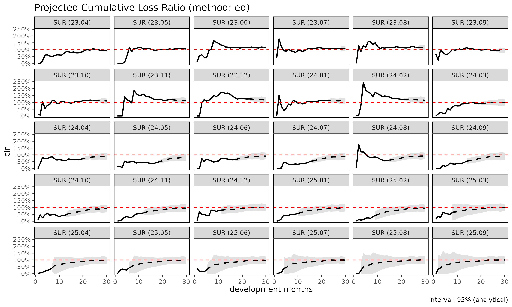

# 손해율 추정 방법론: SA, ED, CL

> 영어 원본 보기: [Loss-ratio projection methods: SA, ED,
> CL](https://seokhoonj.github.io/lossratio/ko/loss-ratio-methods.md)

[`fit_lr()`](https://seokhoonj.github.io/lossratio/ko/reference/fit_lr.md)
은 `triangle` 객체로부터 코호트별 누적 손해율을 추정한다. 세 가지 방법이
제공되며, 본 vignette 은 각 방법의 trade-off 를 설명한다.

## 표기

코호트 $`i`$, dev $`k`$ 에 대하여:

- $`C^L_{i,k}`$ — 누적 손해액
- $`C^P_{i,k}`$ — 누적 위험보험료 (익스포저)
- $`f_k = C^L_{k+1} / C^L_k`$ — 연속 발달비(age-to-age, chain ladder)
  계수
- $`g_k = \Delta C^L_k / C^P_k`$ — 노출 기반(exposure-driven, ED)
  intensity
- 성숙점(maturity point) $`m_g`$ — 그룹 $`g`$ 에서 $`f_k`$ 가 안정화되는
  dev (CV / RSE 임계값으로 탐지)

## 방법 1: 단계 적응적(stage-adaptive, SA) (`"sa"`, 기본값)

기본 방법은 $`f_k`$ 가 초반에는 변동성이 크고 후반에는 안정적이라는
사실, 그리고 $`g_k`$ 는 그 반대로 거동한다는 사실을 활용한다. SA 는
성숙점에서 추정량을 전환한다:

``` math
\hat{C}^L_{i,k+1} \;=\;
\begin{cases}
\hat{C}^L_{i,k} + g_k \cdot C^P_{i,k} & k < m_g \quad \text{(성숙 이전: ED)} \\
f_k \cdot \hat{C}^L_{i,k}              & k \ge m_g \quad \text{(성숙 이후: CL)}
\end{cases}
```

거동:

- **성숙 이전**: 손해 추정치를 보험료 규모에 anchor 한다. 초기 $`f_k`$
  가 노이즈가 있을 때 고전적 CL 이 겪는 변동적 link 폭발을 회피한다.
- **성숙 이후**: 코호트 자체의 관측 수준을 보존한다. pure ED 가 꼬리에서
  겪는 “모든 코호트가 평균으로 수렴” 거동을 회피한다.

사용 시점:

- 발달이 여러 해에 걸치는 long-tail 상품.
- 최근 코호트(미성숙 데이터)와 오래된 코호트(성숙)가 혼재하는 경우.
- 성숙 이전·이후의 구조적 차이가 있는 건강보험 코호트 (예: 면책기간
  전환).

``` r

library(lossratio)
data(experience)
exp <- as_experience(experience)
tri <- build_triangle(exp, group_var = cv_nm)

lr_sa <- fit_lr(tri, method = "sa")        # 기본값
plot(lr_sa, type = "clr")
```


``` r

summary(lr_sa)
#>       cv_nm     cohort     latest   ultimate    reserve exposure_ult clr_latest
#>      <char>     <Date>      <num>      <num>      <num>        <num>      <num>
#>   1:    2CI 2023-04-01 1769961365 1769961365          0   1991886535  0.8885854
#>   2:    2CI 2023-05-01 2177258013 2408047363  230789349   2284418174  1.0198072
#>   3:    2CI 2023-06-01 2004054588 2522359218  518304630   2375671198  0.9676132
#>   4:    2CI 2023-07-01 1740086803 2284297217  544210414   2091234898  0.9992941
#>   5:    2CI 2023-08-01 1020729631 1487357605  466627974   1933805836  0.6725715
#>  ---                                                                           
#> 116:    SUR 2025-05-01   79474575 5330755348 5251280773   3170694512  0.5208363
#> 117:    SUR 2025-06-01   44351381 4669095782 4624744401   2746665433  0.4418904
#> 118:    SUR 2025-07-01   12461511 6405537028 6393075517   3705335918  0.1463368
#> 119:    SUR 2025-08-01          0 5151619396 5151619396   2969197221  0.0000000
#> 120:    SUR 2025-09-01          0 5216378154 5216378154   2995415278  0.0000000
#>        clr_ult maturity_from    proc_se  param_se         se         cv
#>          <num>         <num>      <num>     <num>      <num>      <num>
#>   1: 0.8885854            18          0         0          0 0.00000000
#>   2: 1.0541185            18   81021770  94495076  124474280 0.05169096
#>   3: 1.0617459            18  111885319 114904860  160379087 0.06358297
#>   4: 1.0923198            18  115767968 107391009  157908363 0.06912777
#>   5: 0.7691349            18  209491141 103506080  233666529 0.15710178
#>  ---                                                                   
#> 116: 1.6812579            15 2441571165 725982384 2547218125 0.47783437
#> 117: 1.6999143            15 2282292178 633588616 2368605523 0.50729427
#> 118: 1.7287331            15 2692258007 868125300 2828762046 0.44161200
#> 119: 1.7350210            15 2413061918 697300804 2511791439 0.48757318
#> 120: 1.7414541            15 2425838047 705030372 2526214175 0.48428509
#>          se_clr     cv_clr    ci_lower  ci_upper
#>           <num>      <num>       <num>     <num>
#>   1: 0.00000000 0.00000000 0.888585436 0.8885854
#>   2: 0.05448840 0.05169096 0.947323166 1.1609138
#>   3: 0.06750896 0.06358297 0.929430801 1.1940611
#>   4: 0.07550963 0.06912777 0.944323622 1.2403159
#>   5: 0.12083247 0.15710178 0.532307642 1.0059622
#>  ---                                            
#> 116: 0.80336283 0.47783437 0.106695729 3.2558202
#> 117: 0.86235677 0.50729427 0.009726071 3.3901025
#> 118: 0.76342931 0.44161200 0.232439195 3.2250271
#> 119: 0.84594968 0.48757318 0.076990049 3.3930519
#> 120: 0.84336025 0.48428509 0.088498365 3.3944098
```

## 방법 2: 노출 기반(exposure-driven, ED) (`"ed"`)

모든 미래 증분에 ED 를 적용한다:

``` math
\hat{C}^L_{i,k+1} = \hat{C}^L_{i,k} + g_k \cdot C^P_{i,k}
```

거동:

- 보험료 규모가 전체 발달 구간에 걸쳐 정보를 가질 때 안정적이다.
- 코호트 고유의 수준 신호를 잃는다 — 관측 손해가 더 높은 코호트도 그룹
  단위 $`g_k`$ 로 수렴한다.

사용 시점:

- chain ladder 가 이점을 주지 않는 short-tail 상품.
- 모든 link 에서 age-to-age 계수가 신뢰할 수 없는 희소 데이터.
- SA / CL 과 비교하여 sanity check 용도.

``` r

lr_ed <- fit_lr(tri, method = "ed")
plot(lr_ed, type = "clr")
```



## 방법 3: 고전적 chain ladder (`"cl"`)

고전적 Mack 모형:

``` math
\hat{C}^L_{i,k+1} = f_k \cdot \hat{C}^L_{i,k}
```

거동:

- 표준적인 적립 실무. 손해 투영에 한해서는
  `fit_cl(tri, value_var = "closs")` 과 동등하지만,
  [`fit_lr()`](https://seokhoonj.github.io/lossratio/ko/reference/fit_lr.md)
  은 추가로 `crp` 에 대한 CL 로 익스포저를 전방 추정하고 delta method 로
  손해율 불확실성을 계산한다.
- 초기 $`f_k`$ 가 노이즈가 있을 때 변동적이다 — 작은 분모가 link 오차를
  증폭한다.

사용 시점:

- age-to-age 계수가 전체 발달 구간에서 안정적인 성숙·안정 포트폴리오.
- 규제 당국이 문서화 목적으로 고전적 Mack 형식을 요구하는 적립 작업.

``` r

lr_cl <- fit_lr(tri, method = "cl")
plot(lr_cl, type = "clr")
```


## 비교

``` r

lrs <- list(
  sa = fit_lr(tri, method = "sa"),
  ed = fit_lr(tri, method = "ed"),
  cl = fit_lr(tri, method = "cl")
)

# 코호트 단위 요약
summary(lrs$sa)$ultimate
#>   [1] 1769961365 2408047363 2522359218 2284297217 1487357605 1994001146
#>   [7] 2988589705 2445448251 2569200321 2542066598 1562437905 1892621029
#>  [13] 1968777980 1908366267 2039292781 3794123429 2463723982 1998365566
#>  [19] 1603934657 2496432745 2861131473 1845055218 2392196327 1961413974
#>  [25] 2059107725 2065941642 2230112617 1615330864 2872323158 2220898189
#>  [31] 1456513239 1541495476 1257633154 1502619222 1310223639 1887287275
#>  [37] 1731723945 1306927982 1947524107 1579308197 2135117636 1375380743
#>  [43] 1510222234 1014225050 1703418963  948509797 1223273206 1287663798
#>  [49] 1801895253 1161006963 1374851993 1834088192 1688971979 1701300247
#>  [55] 1867014816 1315751586 1369532372 1197153150 1345073027 1601957181
#>  [61] 1215686760 1444304949 1298364041 1027781188 1316126638 1248695550
#>  [67] 1046962226 1130933419 1399722620 1274297134 1239934175  911239875
#>  [73]  944277368 1323957786 1041765185 1009153969 1377255916  970975315
#>  [79] 1036138599 1340998202 1060712370 1157135473 1264771509 1086740717
#>  [85]  946872345 1423859980 1050210221 1367653541 1215785116 1004394044
#>  [91] 3507505356 4692659098 4989741692 6249920460 4790104551 4586214482
#>  [97] 6156953685 6353810849 4756961997 5310789808 5390468156 3605760085
#> [103] 7343304556 2925726831 4443751247 3113972263 5184406888 4529063006
#> [109] 6507558014 3790320997 4334152656 5036348322 4645763088 4434935578
#> [115] 4826181874 5330755348 4669095782 6405537028 5151619396 5216378154
summary(lrs$ed)$ultimate
#>   [1] 1769961365 2371369509 2460337882 2211270583 1606856997 2124757581
#>   [7] 2626077426 2364904728 2340670757 2495827356 1889174106 1885283426
#>  [13] 1945847523 2106256656 2163228626 2956796298 2140921061 2064716732
#>  [19] 1894290331 2416948826 2466039703 1884522098 2193895245 1969894294
#>  [25] 2026964047 1955461676 2158256961 1583444742 2809192264 2162728815
#>  [31] 1456513239 1538829011 1275714692 1491586015 1342287124 1773935325
#>  [37] 1697666819 1349645259 1812684235 1625745452 1922775044 1437854891
#>  [43] 1437015939 1356726029 1676749869 1327671143 1472876547 1351838452
#>  [49] 1811882717 1389906597 1425420782 1806191957 1488543934 1844326199
#>  [55] 1932899263 1338958697 1423947288 1240969569 1373975289 1642139384
#>  [61] 1215686760 1440155089 1307980220 1054411624 1319241901 1283315379
#>  [67] 1117418295 1206152143 1352972282 1283413822 1245510532 1090885427
#>  [73] 1060666925 1342146750 1119141562 1198243775 1252225569 1095360704
#>  [79] 1122604276 1372408410 1075777145 1147965559 1312438254 1172413516
#>  [85]  979927375 1412759675 1088790354 1385687568 1245194906 1039113729
#>  [91] 3507505356 4605415816 4930871386 5959788482 4672175363 4595106877
#>  [97] 5855425007 5833684111 4771971051 5196228710 4958395332 3978539481
#> [103] 5694379888 3987348485 4562068898 4308983818 5154934931 4567749275
#> [109] 5117023994 4262600100 4800685044 4941956365 5200984658 4822545310
#> [115] 4891314060 5470100694 4753705577 6444449419 5169648278 5220990643
summary(lrs$cl)$ultimate
#>   [1] 1769961365 2408047363 2522359218 2284297217 1487357605 1994001146
#>   [7] 2988589705 2445448251 2569200321 2542066598 1562437905 1892621029
#>  [13] 1968777980 1849597147 1960990647 4536653585 2848051433 1814043775
#>  [19]  803899382 2610474889 4676753200 1305221077 3713175992 1365003301
#>  [25] 1818998789 3599875442 2840900353  614093180          0          0
#>  [31] 1456513239 1541495476 1257633154 1502619222 1310223639 1887287275
#>  [37] 1731723945 1306927982 1947524107 1579308197 2135117636 1375380743
#>  [43] 1510222234 1014225050 1709930281  748281800 1006119255 1218179464
#>  [49] 1829438235  594622982 1292796914 2201696660 3220902659  791365041
#>  [55] 1508285970 1486913260  619123757   87050260 2306673924          0
#>  [61] 1215686760 1444304949 1298364041 1027781188 1316126638 1248695550
#>  [67] 1046962226 1130933419 1399722620 1274297134 1239934175  911239875
#>  [73]  944277368 1323957786 1035562280  950080620 1531304715  842428365
#>  [79]  931313427 1388724904 1151344508 1413167331 1254215415  633273817
#>  [85]  963621618 2839791792  989717711 3881172743 4917836020          0
#>  [91] 3507505356 4692659098 4989741692 6249920460 4790104551 4586214482
#>  [97] 6156953685 6353810849 4756961997 5310789808 5390468156 3605760085
#> [103] 7343304556 2925726831 4443751247 3113972263 5179388346 4479020413
#> [109] 7711276603 3075404317 3257251807 5092462598 2332563087 1619023322
#> [115] 3769384328 2873248566 2365070816 2312527756          0          0
```

## 분산과 신뢰구간

[`fit_lr()`](https://seokhoonj.github.io/lossratio/ko/reference/fit_lr.md)
은 delta method 로 해석적 표준오차를 산출한다. delta method 변형은 두
가지이다:

- `delta_method = "simple"` (기본값) — 익스포저를 고정으로 취급,
  $`\mathrm{SE}(L/E) \approx \mathrm{SE}(L)/E`$.
- `delta_method = "full"` — 익스포저 불확실성과 손해-익스포저 상관계수
  `rho` 를 반영한다:

``` math
\mathrm{Var}(L/E) \approx \frac{\mathrm{Var}(L)}{E^2}
  + \frac{L^2 \mathrm{Var}(E)}{E^4}
  - \frac{2 \rho L \mathrm{SE}(L) \mathrm{SE}(E)}{E^3}
```

부트스트랩 구간도 사용 가능하다:

``` r

lr_boot <- fit_lr(tri, method = "sa", bootstrap = TRUE, B = 1000, seed = 1)
summary(lr_boot)
#>       cv_nm     cohort     latest   ultimate    reserve exposure_ult clr_latest
#>      <char>     <Date>      <num>      <num>      <num>        <num>      <num>
#>   1:    2CI 2023-04-01 1769961365 1769961365          0   1991886535  0.8885854
#>   2:    2CI 2023-05-01 2177258013 2408047363  230789349   2284418174  1.0198072
#>   3:    2CI 2023-06-01 2004054588 2522359218  518304630   2375671198  0.9676132
#>   4:    2CI 2023-07-01 1740086803 2284297217  544210414   2091234898  0.9992941
#>   5:    2CI 2023-08-01 1020729631 1487357605  466627974   1933805836  0.6725715
#>  ---                                                                           
#> 116:    SUR 2025-05-01   79474575 5330755348 5251280773   3170694512  0.5208363
#> 117:    SUR 2025-06-01   44351381 4669095782 4624744401   2746665433  0.4418904
#> 118:    SUR 2025-07-01   12461511 6405537028 6393075517   3705335918  0.1463368
#> 119:    SUR 2025-08-01          0 5151619396 5151619396   2969197221  0.0000000
#> 120:    SUR 2025-09-01          0 5216378154 5216378154   2995415278  0.0000000
#>        clr_ult maturity_from    proc_se  param_se         se         cv
#>          <num>         <num>      <num>     <num>      <num>      <num>
#>   1: 0.8885854            18          0         0          0 0.00000000
#>   2: 1.0541185            18   81021770  94495076  124474280 0.05169096
#>   3: 1.0617459            18  111885319 114904860  160379087 0.06358297
#>   4: 1.0923198            18  115767968 107391009  157908363 0.06912777
#>   5: 0.7691349            18  209491141 103506080  233666529 0.15710178
#>  ---                                                                   
#> 116: 1.6812579            15 2441571165 725982384 2547218125 0.47783437
#> 117: 1.6999143            15 2282292178 633588616 2368605523 0.50729427
#> 118: 1.7287331            15 2692258007 868125300 2828762046 0.44161200
#> 119: 1.7350210            15 2413061918 697300804 2511791439 0.48757318
#> 120: 1.7414541            15 2425838047 705030372 2526214175 0.48428509
#>          se_clr     cv_clr  ci_lower  ci_upper
#>           <num>      <num>     <num>     <num>
#>   1: 0.00000000 0.00000000 0.8885854 0.8885854
#>   2: 0.05448840 0.05169096 0.9436512 1.1684941
#>   3: 0.06750896 0.06358297 0.9426279 1.1903008
#>   4: 0.07550963 0.06912777 0.9495549 1.2411672
#>   5: 0.12083247 0.15710178 0.5477070 1.0155367
#>  ---                                          
#> 116: 0.80336283 0.47783437 0.3849513 3.6953964
#> 117: 0.86235677 0.50729427 0.2277595 3.4475374
#> 118: 0.76342931 0.44161200 0.4288979 3.3528555
#> 119: 0.84594968 0.48757318 0.2306288 3.5450720
#> 120: 0.84336025 0.48428509 0.2975347 3.5640864
```

## 방법 선택

빠른 의사결정 흐름:

    포트폴리오가 완전히 성숙했는가 (모든 코호트가 성숙점 이후)?
      ├── Yes  →  "cl" (고전적, 규제 친화적)
      └── No
            ├── 초기 age-to-age 계수가 변동적인가?
            │     ├── Yes  →  "sa" (기본 — 노출 기반 평활)
            │     └── No   →  "cl"
            └── 익스포저(rp) 가 더 정보적인 신호인가?
                  ├── Yes  →  "ed"
                  └── No   →  "sa"

실무: **`"sa"` 로 시작하라** (기본값). 이후 민감도 점검을 위해 `"cl"` 과
`"ed"` 를 함께 실행한다. 셋이 모두 일치하면 추정은 견고하다. 결과가
갈라지면 성숙점 탐지와 기저 ata 계수를 점검한다.
