# Triangle 및 ata 진단

> 영어 원본 보기: [Triangle and ata
> diagnostics](https://seokhoonj.github.io/lossratio/ko/triangle-diagnostics.md)

chain ladder 또는 손해율 모형을 적합하기 전에 기반이 되는 triangle 을
살펴보는 것이 효율적이다. 이 vignette 는 코호트 거동, age-to-age 인자의
안정성, 성숙점 탐지를 이해하기 위한 `lossratio` 의 진단 도구를 다룬다.

## Triangle 수준 진단

``` r

library(lossratio)
data(experience)
exp <- as_experience(experience)
tri <- build_triangle(exp, group_var = cv_nm)
```

### 코호트 궤적

``` r

plot(tri)                              # 코호트별 raw clr 궤적
```


``` r

plot(tri, value_var = "loss")          # clr 대신 누적 loss
```

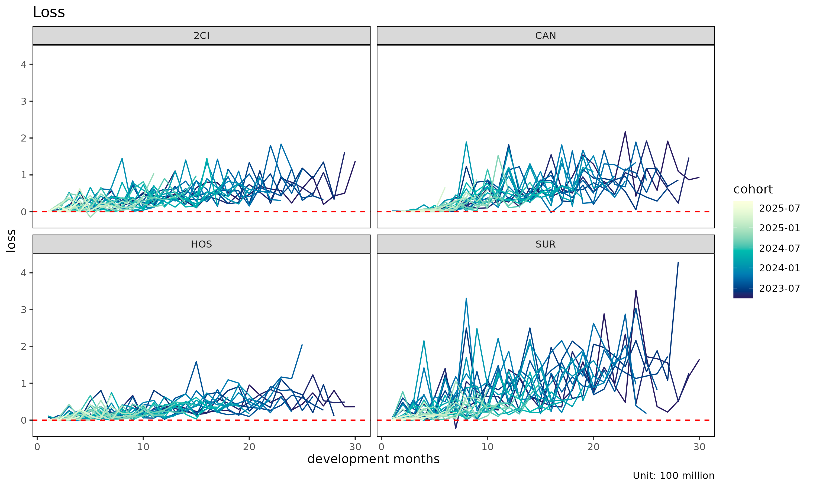

``` r

plot(tri, summary = TRUE)              # raw + overlay (mean / median / weighted)
```

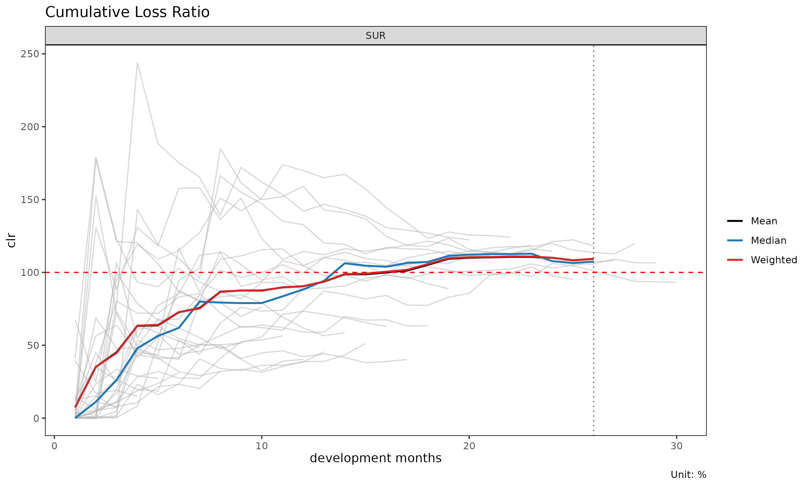

`summary = TRUE` overlay 는 각 dev 에서 평균, 중앙값, 가중 clr 을 계산해
코호트 선 위에 겹쳐 그린다. 중심 경향에서 벗어나는 코호트를 포착하는 데
유용하다.

### 셀 히트맵

``` r

plot_triangle(tri)                          # 각 셀의 clr
```


``` r

plot_triangle(tri, value_var = "loss")      # 누적 loss
```


``` r

plot_triangle(tri, label_style = "detail")  # 비율 + (loss / rp) 금액
```


### dev 별 그룹 통계

``` r

sm <- summary(tri)
head(sm)
#> Key: <cv_nm, dev>
#>     cv_nm   dev n_obs    lr_mean    lr_median      lr_wt   clr_mean
#>    <char> <int> <int>      <num>        <num>      <num>      <num>
#> 1:    2CI     1    30 0.07682952 0.0000684217 0.09346191 0.07682952
#> 2:    2CI     2    29 0.31682799 0.0002658639 0.37921332 0.21699608
#> 3:    2CI     3    28 0.46725413 0.1418544378 0.43601945 0.33392280
#> 4:    2CI     4    27 0.64199653 0.5374941298 0.61222448 0.45737038
#> 5:    2CI     5    26 0.64809352 0.2890663538 0.65077672 0.50492686
#> 6:    2CI     6    25 1.00328576 0.4230790053 1.05243689 0.63430163
#>      clr_median     clr_wt
#>           <num>      <num>
#> 1: 0.0000684217 0.09346191
#> 2: 0.0274751765 0.25081620
#> 3: 0.1477140322 0.33811373
#> 4: 0.3862054651 0.43323143
#> 5: 0.3658265200 0.49590320
#> 6: 0.4266323751 0.63494667
```

(group, dev) 셀별 평균 / 중앙값 / 가중 손해율을 담은 `triangle_summary`
객체를 반환한다.

## Age-to-age 인자 진단

``` r

ata <- build_ata(tri, value_var = "closs")
sm  <- summary_ata(ata, alpha = 1)
head(sm)
#> Key: <cv_nm>
#>     cv_nm ata_from ata_to ata_link      mean median    wt    cv     f   f_se
#>    <char>    <num>  <num>   <fctr>     <num>  <num> <num> <num> <num>  <num>
#> 1:    2CI        1      2      1-2 34274.413  1.026 5.709 3.984 4.008 69.971
#> 2:    2CI        2      3      2-3    40.708  2.852 2.281 2.795 2.027  3.353
#> 3:    2CI        3      4      3-4    32.952  2.349 1.890 3.737 1.781  0.896
#> 4:    2CI        4      5      4-5     2.937  1.350 1.646 2.115 1.646  0.373
#> 5:    2CI        5      6      5-6     2.810  1.308 1.791 1.278 1.791  0.356
#> 6:    2CI        6      7      6-7     1.324  1.189 1.225 0.353 1.225  0.068
#>       rse      sigma n_obs n_valid n_inf n_nan valid_ratio
#>     <num>      <num> <num>   <num> <num> <num>       <num>
#> 1: 17.460 412335.337    29      16     0     0       0.552
#> 2:  1.655  47209.055    28      22     0     0       0.786
#> 3:  0.503  18961.582    27      26     0     0       0.963
#> 4:  0.227  10617.916    26      26     0     0       1.000
#> 5:  0.199  12597.734    25      25     0     0       1.000
#> 6:  0.056   3169.431    24      24     0     0       1.000
```

[`summary_ata()`](https://seokhoonj.github.io/lossratio/ko/reference/summary_ata.md)
는 성숙점 탐지를 구동하는 링크별 통계를 계산한다.

- `mean`, `median`, `wt` — 각 링크에서 관측된 ata 인자의 기술 평균 (해당
  링크가 관측되지 않은 코호트는 제외).
- `cv` — 관측 인자의 변동계수 (상대 산포, alpha 와 무관).
- `f` — WLS 로 추정된 인자 (`value_from^alpha` 로 볼륨 가중).
- `f_se`, `rse` — WLS 표준오차 및 상대 표준오차.
- `sigma` — 링크별 Mack 잔차 sigma.
- `n_obs`, `n_valid`, `n_inf`, `n_nan`, `valid_ratio` — 관측 수와 링크별
  유한 ata 인자의 비율.

### `ata` 진단 플롯

``` r

plot(ata, type = "cv")            # ata 링크별 CV (성숙점 overlay 포함)
```

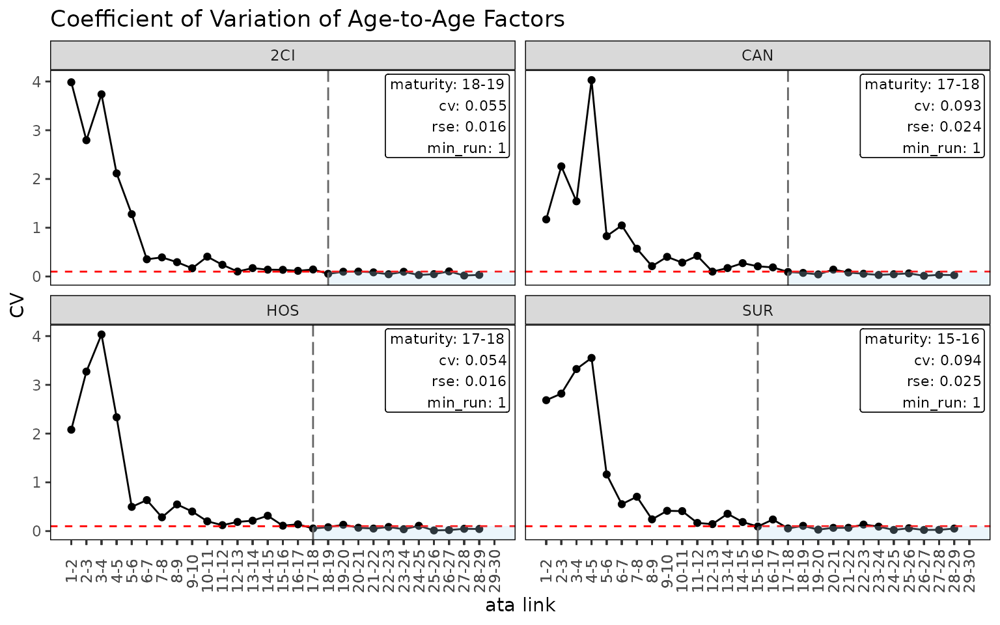

``` r

plot(ata, type = "rse")           # ata 링크별 RSE
```

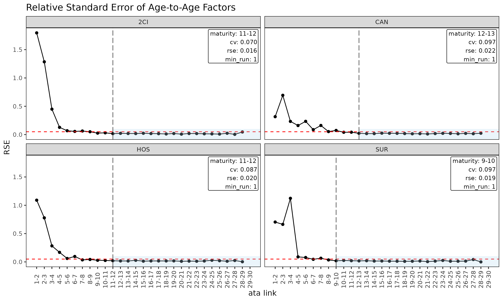

``` r

plot(ata, type = "summary")       # 링크별 mean / median / wt overlay
```


``` r

plot(ata, type = "box")           # 링크별 관측 ata 의 boxplot
```

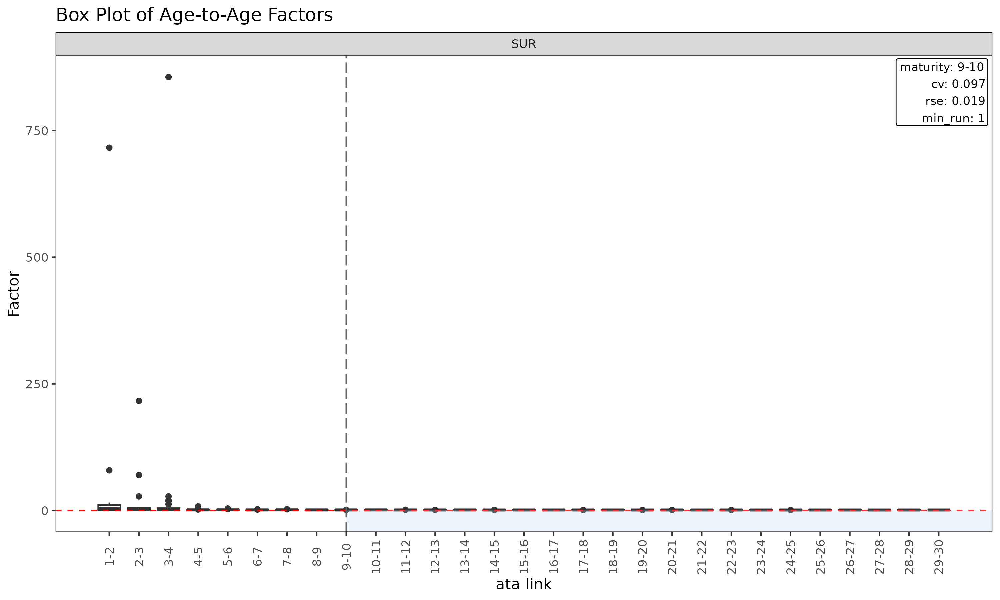

``` r

plot(ata, type = "point")         # 링크별 관측 ata 의 산점도
```

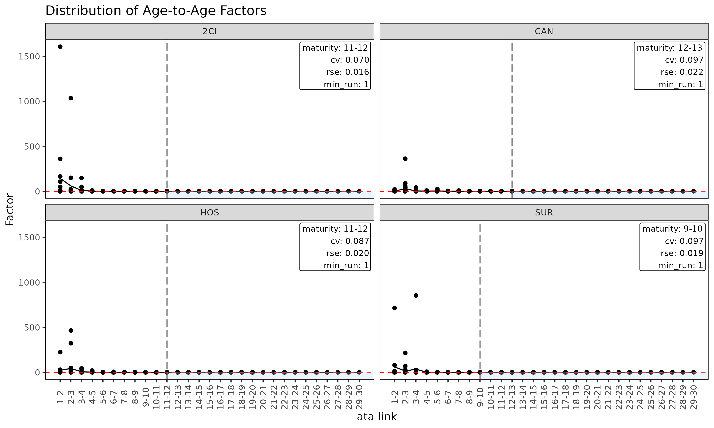

### ata 인자의 triangle

``` r

plot_triangle(ata)                                # 관측 인자 히트맵
```

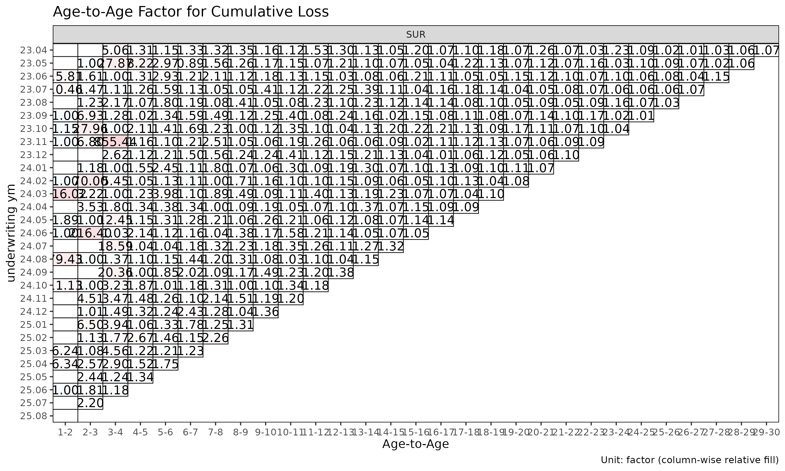

``` r

plot_triangle(ata, label_style = "detail")        # 인자 + (loss / rp) 금액
```

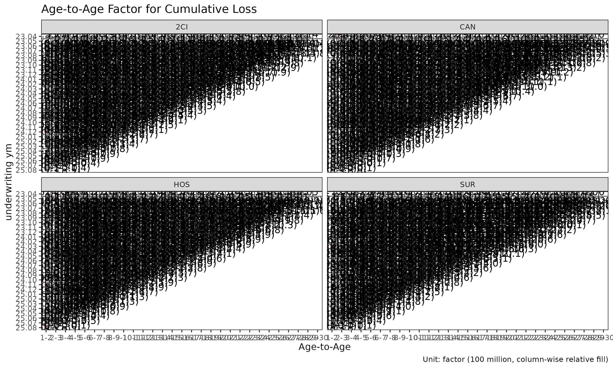

``` r

plot_triangle(ata, show_maturity = TRUE)          # 성숙점 라인 overlay
```

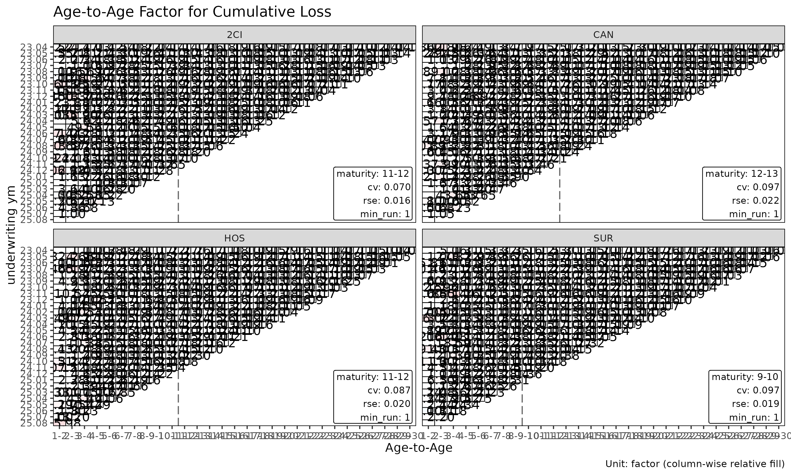

이 히트맵은 각 셀을 자기 링크 내에서 `log(ata / median(ata))` 로
색칠하므로, 열 방향 색상은 해당 링크의 중앙값에서 벗어나는 코호트를
구분해 준다.

## 성숙점 탐지

성숙점(maturity point) 은 age-to-age 인자가 chain ladder 추정에 신뢰할
만큼 안정화되는 경과 기간 링크이다. `fit_lr(method = "sa")` 가 ED 에서
CL 로 전환할 때 내부적으로 사용한다.

[`find_ata_maturity()`](https://seokhoonj.github.io/lossratio/ko/reference/find_ata_maturity.md)
는
[`summary_ata()`](https://seokhoonj.github.io/lossratio/ko/reference/summary_ata.md)
객체를 입력으로 받는다 — 먼저 기술/WLS 요약을 만들고, 거기서 첫 성숙
링크를 탐색한다.

``` r

sm  <- summary_ata(ata, alpha = 1)
mat <- find_ata_maturity(
  sm,
  cv_threshold    = 0.10,    # CV 가 이 값보다 작아야 함
  rse_threshold   = 0.05,    # RSE 가 이 값보다 작아야 함
  min_valid_ratio = 0.5,     # 해당 링크에서 유한 코호트가 50% 이상
  min_n_valid     = 3L,      # 유한 코호트가 최소 3개
  min_run         = 1L       # 연속 성숙 링크 최소 1개
)

print(mat)
#> Key: <cv_nm>
#>     cv_nm ata_from ata_to ata_link  mean median    wt    cv     f  f_se   rse
#>    <char>    <num>  <num>   <char> <num>  <num> <num> <num> <num> <num> <num>
#> 1:    2CI       18     19    18-19 1.076  1.047 1.076 0.055 1.076 0.017 0.016
#> 2:    CAN       17     18    17-18 1.137  1.119 1.126 0.093 1.126 0.027 0.024
#> 3:    HOS       17     18    17-18 1.107  1.092 1.101 0.054 1.101 0.018 0.016
#> 4:    SUR       15     16    15-16 1.092  1.038 1.098 0.094 1.098 0.027 0.025
#>       sigma n_obs n_valid n_inf n_nan valid_ratio
#>       <num> <num>   <num> <num> <num>       <num>
#> 1: 1650.456    12      12     0     0           1
#> 2: 2473.092    13      13     0     0           1
#> 3: 1350.950    13      13     0     0           1
#> 4: 4057.711    15      15     0     0           1
```

그룹별로 모든 임계값을 만족하는 첫 경과 기간 링크 한 행이 출력되며, 해당
링크의 전체 통계가 같이 실린다. 임계값 인자들은 반환 객체의 attribute
로도 저장된다.
[`find_ata_maturity()`](https://seokhoonj.github.io/lossratio/ko/reference/find_ata_maturity.md)
는 `maturity_args` 가 주어진 경우
[`fit_ata()`](https://seokhoonj.github.io/lossratio/ko/reference/fit_ata.md)
와
[`fit_cl()`](https://seokhoonj.github.io/lossratio/ko/reference/fit_cl.md)
내부에서도 호출된다 (내부
[`summary_ata()`](https://seokhoonj.github.io/lossratio/ko/reference/summary_ata.md)
단계의 `alpha` 는 호출자의 값을 그대로 받는다).

임계값은 포트폴리오의 변동성 프로파일에 맞춰 조정한다. 임계값을 빡빡하게
(예: `cv_threshold = 0.05`) 잡으면 성숙점이 뒤로 밀리고, 느슨하게 잡으면
앞으로 당겨진다.

## ED 진단

``` r

ed <- build_ed(tri, loss_var = "closs", exposure_var = "crp")
sm <- summary_ed(ed, alpha = 1)
head(sm)
#> Key: <cv_nm>
#>     cv_nm ata_from ata_to ata_link    mean  median      wt      cv       g
#>    <char>    <num>  <num>   <fctr>   <num>   <num>   <num>   <num>   <num>
#> 1:    2CI        1      2      1-2 0.43017 0.00025 0.45524 2.85861 0.45524
#> 2:    2CI        2      3      2-3 0.34713 0.13068 0.33637 2.20434 0.33637
#> 3:    2CI        3      4      3-4 0.33564 0.27159 0.30584 1.01829 0.30584
#> 4:    2CI        4      5      4-5 0.28380 0.10896 0.27756 1.39025 0.27756
#> 5:    2CI        5      6      5-6 0.38135 0.11079 0.38237 1.72311 0.38237
#> 6:    2CI        6      7      6-7 0.14598 0.10207 0.14379 1.12284 0.14379
#>       g_se     rse    sigma n_obs n_valid n_inf n_nan valid_ratio
#>      <num>   <num>    <num> <num>   <num> <num> <num>       <num>
#> 1: 0.24492 0.53801 4641.876    29      29     0     0           1
#> 2: 0.13535 0.40238 3719.065    28      28     0     0           1
#> 3: 0.06214 0.20318 2242.307    27      27     0     0           1
#> 4: 0.07533 0.27141 3266.851    26      26     0     0           1
#> 5: 0.13019 0.34048 6627.107    25      25     0     0           1
#> 6: 0.03288 0.22867 1917.319    24      24     0     0           1

plot(ed, type = "summary")
```

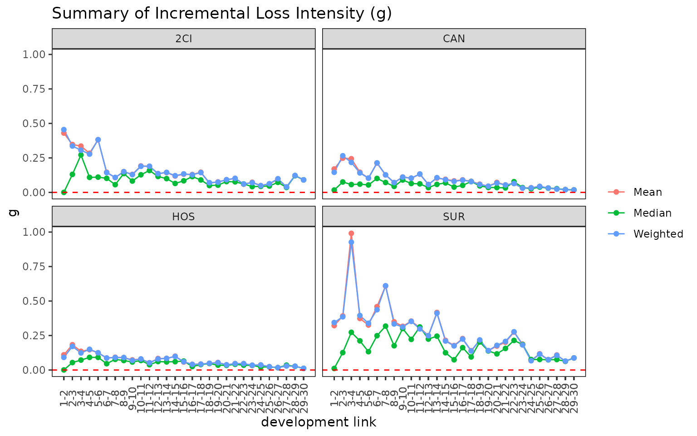

``` r

plot(ed, type = "box")
```

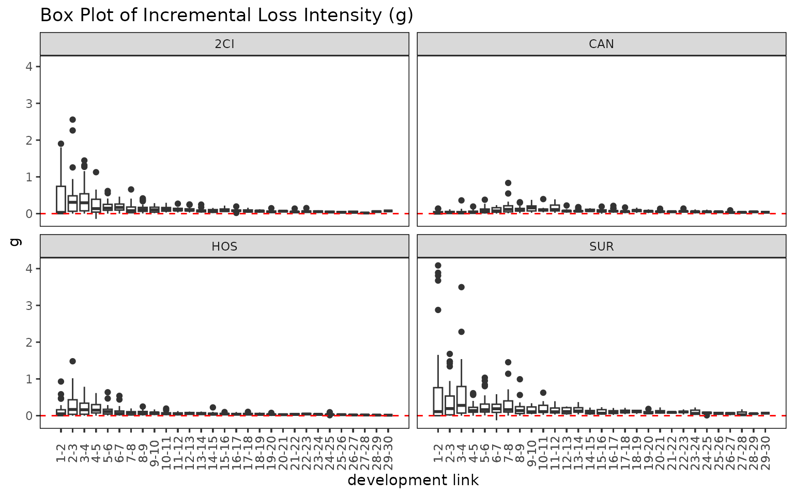

``` r

plot_triangle(ed)
```


[`summary_ed()`](https://seokhoonj.github.io/lossratio/ko/reference/summary_ed.md)
는
[`summary_ata()`](https://seokhoonj.github.io/lossratio/ko/reference/summary_ata.md)
의 ED 측 대응물로, 강도 $`g_k = \Delta C^L_k / C^P_k`$ 에 대해 링크별
통계를 계산한다.

## 빌드 전 검증

경과 기간 시퀀스에 결손이 의심되면
[`build_triangle()`](https://seokhoonj.github.io/lossratio/ko/reference/build_triangle.md)
호출 전에 점검한다.

``` r

gaps <- validate_triangle(exp, group_var = cv_nm,
                          cohort_var = "uym", dev_var = "elap_m")
head(gaps)
#> Empty data.table (0 rows and 5 cols): cv_nm,uym,n_observed,n_expected,missing
```

경과 기간이 비연속인 코호트마다 한 행씩을 담은 `triangle_validation`
객체를 반환한다. 결과가 비어 있다면 triangle 이 깨끗하다는 뜻이다.

결손이 있는 경우의 선택지는 다음과 같다.

- 데이터 원본을 수정한다 (권장).
- 문제가 있는 코호트를 제외한다.
- [`build_triangle()`](https://seokhoonj.github.io/lossratio/ko/reference/build_triangle.md)
  에 `fill_gaps = TRUE` 를 넘겨 누락 셀을 0 으로 채운다 (단, `n_obs` 가
  부풀어 오르므로 신중히 사용).

## 최근 대각선 부분집합

오래된 코호트가 더 이상 대표성이 없을 때 (요율 변경, 적립 regime 변경
등) 추정을 최근 대각선으로 제한한다.

``` r

fit_ata(ata, alpha = 1, recent = 12)        # 최근 12개 대각선
#> <ata_fit>
#> alpha       : 1 
#> sigma_method: min_last2 
#> recent      : 12 
#> use_maturity: FALSE 
#> groups      : cv_nm 
#> n_groups    : 4 
#> ata links   : 116
fit_cl(tri, value_var = "closs", recent = 12)
#> <cl_fit>
#> method      : basic 
#> value_var   : closs 
#> weight_var  : none 
#> alpha       : 1 
#> recent      : 12 
#> use_maturity: FALSE 
#> tail_factor : 1 
#> groups      : cv_nm 
#> periods     : 30
fit_lr(tri, recent = 12)
#> <lr_fit>
#> method        : sa 
#> loss_var      : closs 
#> exposure_var  : crp 
#> loss_alpha    : 1 
#> exposure_alpha: 1 
#> delta_method  : simple 
#> conf_level    : 0.95 
#> ci_type       : analytical  
#> sigma_method  : min_last2 
#> recent        : 12 
#> maturity[2CI] : 18
#> maturity[CAN] : 18
#> maturity[HOS] : 18
#> maturity[SUR] : 19
#> groups        : cv_nm 
#> periods       : 120
```

`recent = K` 는 calendar 위치 (`rank(cohort) + dev - 1`) 가 그룹 내 최근
`K` 개에 속하는 행만 남긴다.

## 워크플로 체크리스트

적합 전에 확인할 사항은 다음과 같다.

1.  [`validate_triangle()`](https://seokhoonj.github.io/lossratio/ko/reference/validate_triangle.md)
    — 스키마와 결손 점검.
2.  [`build_triangle()`](https://seokhoonj.github.io/lossratio/ko/reference/build_triangle.md)
    — 파생 컬럼이 포함된 표준 형태 구축.
3.  `plot(tri)` / `plot_triangle(tri)` — 시각적 점검.
4.  `summary(tri)` — 그룹 수준 중심 경향 확인.
5.  [`build_ata()`](https://seokhoonj.github.io/lossratio/ko/reference/build_ata.md) +
    `plot(ata, type = "cv")` — 링크 안정성 확인.
6.  [`find_ata_maturity()`](https://seokhoonj.github.io/lossratio/ko/reference/find_ata_maturity.md)
    — 그룹별로 합리적 성숙점이 잡히는지 확인.
7.  [`detect_cohort_regime()`](https://seokhoonj.github.io/lossratio/ko/reference/detect_cohort_regime.md)
    (선택) — 구조적 변화 진단.

이후 신뢰할 수 있는 입력 데이터로
[`fit_lr()`](https://seokhoonj.github.io/lossratio/ko/reference/fit_lr.md)
/
[`fit_cl()`](https://seokhoonj.github.io/lossratio/ko/reference/fit_cl.md)
을 적합한다.

## 함께 보기

- [`vignette("getting-started")`](https://seokhoonj.github.io/lossratio/ko/articles/getting-started.md)
  — 전체 파이프라인 개요.
- [`vignette("regime-detection")`](https://seokhoonj.github.io/lossratio/ko/articles/regime-detection.md)
  —
  [`detect_cohort_regime()`](https://seokhoonj.github.io/lossratio/ko/reference/detect_cohort_regime.md)
  심화.
- [`vignette("loss-ratio-methods")`](https://seokhoonj.github.io/lossratio/ko/articles/loss-ratio-methods.md)
  — 추정 방법 선택.
